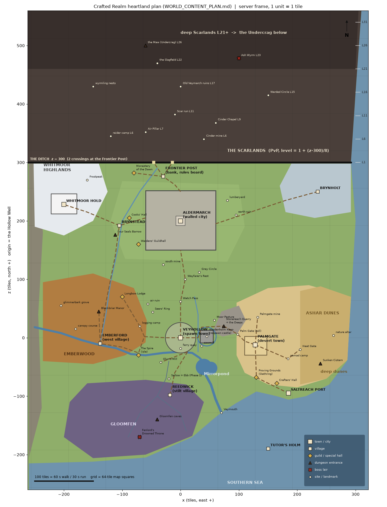

# World content plan: the heartland, every building, the grind ladder and the build order

Status: plan (2026-09-26), for the W3–W5 milestones in `WORLD_GOAL_2026-09-25.md`. No game code was changed.
Readers: the Blender artists who model the towns, the gameplay engineers who wire services, NPCs and drops, and the
owner, who signs off the open decisions in §6.

Owner brief (2026-09-26, paraphrased): once Tutor's Holm is locked in, build the main world like the 2004 heartland.
A spawn area like Lumbridge (a castle); a swamp with a small town to the south; a desert town like Al Kharid to the
east; a village like Draynor to the west; a big city like Varrock to the north; and a Wilderness for PvP. *"Big castles
where needed, big towns with lots of variety in building shapes and uniqueness, and story flow... analysing every
building in Old School RuneScape and having some version of that, with that functionality built in, but it doesn't
have to be organised the exact same."* Grindy, very open, everything functional and fun, old-school medieval feel.

**Sources.**
- Our canon: `STORY_BIBLE.md`, `VEYHOLLOW_DESIGN.md`, `WORLD_GOAL_2026-09-25.md`, `src/game1_data.js` (ITEMS, TIERS,
  NPC_TYPES, SHOPS, QUESTS, ZONES), `docs/rebuild/scarlands/bestiary_v1.data.json`.
- Measured 2004 geography: `WORLD_LAYOUT_GUIDE.md` (distances, town sizes, roads, the Wilderness edge).
- 2004 functions: the 2004scape server scripts (`C:\Users\iQwaZ\repos\2004scape\Server\data\src\scripts`: areas, shops,
  skills, quests), studied for *what existed and at which level* only.
- Building and location lists per town: the OSRS Wiki (fetched 2026-09-26), with functions paraphrased. Post-2004
  content is marked *later* where it matters.

**IP rule** (`REFERENCE_2004SCAPE.md`, bible §0). Every name, place, layout, line of dialogue and model below is our
own. What we take from 2004 is *structure and role*: a castle that respawns you, a furnace next to a bank, a toll gate
freed by a quest, a bank 24 tiles from the Wilderness edge.

**Frame.** Server map: +x east, +z north, origin at the Hollow Well (0, 0), 1 unit = 1 tile (`WORLD_LAYOUT_GUIDE.md`
§4). Client World V2 is (x, −z). Every coordinate in this file is a planning anchor. The approved chunk data becomes
the truth once it is built. The legacy `ZONES` table in `game1_data.js` is in the old client frame (north = −z) and
predates this plan (§1.8).

**Figures.**
- `scratchpad/world_content_plan/heartland_map.png` (and `.svg`), drawn by `heartland_map.py`.
- `scratchpad/world_content_plan/road_distances.py` gives the walked distances in §1.2. They are computed with
  8-direction steps over the road graph, so they are lower bounds.

---

## 0. The plan on one screen

| Owner's compass | Our place (new names in bold) | Role in the game | Walked from the Hollow Well |
|---|---|---|---:|
| Spawn, a castle | Veyhollow Commons + Wardenholm Keep | Starter town. The keep courtyard is the respawn point. Bank, general store, smithy, chapel, pub, farms, mill. Combat 1–15 | 0 / 45 |
| North, a big city | **Aldermarch**, the walled March city | Capital and main trade and PvP-supply hub: 2 banks, a market, 10+ specialist shops, the cathedral, the Wardens' Guildhall, sewers. Combat 5–45 | 200 |
| Beyond the city | **Frontier Post** → the Ditch → the Scarlands | Frontier Post (the Edgeville role): bank booth, rules board, supplies, 24 tiles from the Ditch. The Scarlands: PvP, deeper is deadlier | 282 / 306 |
| East, a desert town | **Palmgate** + the Ashar Dunes | Toll gate on the Sandscarp, domed adobe town, the best furnace next to a bank, tannery, sabres, gems. The Proving Grounds (duel arena) lie south of it. Combat 10–40 | 140 |
| West, a village | **Emberford** + Emberwood | River bank village by willows (Woodcutting and Firemaking), market stalls, lock-up, chandler. Blackbriar Manor (the spooky house) and the Spire (the wizards' tower) nearby. Combat 5–35 | 156 |
| South, a swamp + small town | Gloomfen + **Reedwick** | Stilt village on the fen rim: herbalist (the Herblore unlock), eels, the Drowned Chapel. The Fenlord deep in the fen. Combat 3–55 | 104 |
| North-west | Whitmoor Hold + **Brynstead** | Knights' hold (the Falador role): whitsteel, chain, mace and shield shops, the warriors' hall, and the quest tunnel to the Undercrag. Brynstead is the northerners' river village | 400 / 305 |
| North-east | Brynholt | Raider coast: bowyers, longship Agility course, deep-sea fishing | 435 |
| South-east | Saltreach Port | Harbour: charters, the dragon-quest ship, fishing, jewellery, glassworks, the Crafters' Hall | 251 (or the salt barge) |
| Deep north | The Undercrag | Endgame dungeon under the deep Scarlands. Korthul, undercrag ore | — |

**Numbers that follow the 2004 study.**
- Neighbouring settlements are 45–110 walked tiles apart; major towns are 140–235 apart.
- Every route has a feature at least every 20–25 tiles (the draw distance is 25).
- Towns sit on flat ground by water. Each has one landmark 3–10× the size of a house.
- Squares are 12–18 tiles across. Roads are 3 wide.

**What changes in the bible** (§1.1):
- Gloomfen moves from the south-west to the south.
- The Proving Grounds move beside the desert town.
- Whitmoor Hold and Brynholt stay on the *safe* side of the Ditch, flanking the Scarlands.
- The Ditch moves from z 122 in the W3 slice to z 300, because the big city sits between the spawn and the Wilderness,
  as Varrock does.
- The city is named **Aldermarch**.

**Build order** (§5):
1. Veyhollow and its ring, the W3 core.
2. The North: the road, the Aldermarch core, the Frontier Post and Scarlands L1–10. This is PvP first, as the owner
   asked.
3. The West: Emberwood, Emberford, the Spire and Blackbriar Manor.
4. The East: Stonereach Deeps, Palmgate and the Proving Grounds.
5. The South: Gloomfen, Reedwick and Saltreach.
6. The corners: the full Aldermarch, Whitmoor, Brynstead, Brynholt, Cinder Isle, the deep Scarlands and the
   Undercrag.
7. The long tail: Waystone Isle, the deep dunes, the Undercrag Deeps, Scarlands L26–40.

Each phase keeps all 19 skills trainable for its level band.

---

## 1. The heartland map



```
                                          N
   deep Scarlands L21-26:  wyrmling nests . the Slagfield . Ash Wyrm lair . the Maw (-> UNDERCRAG)
   Scarlands L1-20:  raider camp L6 . Cinder Chapel L9 . Scar Run L11 . Warded Circle L15 . Old Veymarch L17
 ============================ THE DITCH  z 300  ===[plank -46]==[causeway -14]============================
  WHITMOOR       Monastery of    FRONTIER POST (bank booth, rules board)                  BRYNHOLT
  HOLD (keep)    the Dawn  \___________/                                                (frost coast)
     \ Frostpeak                 |                                                          /
      \___ BRYNSTEAD ____ Cooks' Hall __[ ALDERMARCH  walled city 120x102 ]__ lumberyard __/
      Four Seals Barrow      Wardens' Guildhall   |           earth altar
             |                     south mine     |  Grey Circle
             | Old Forest Road             Wayfarer's Rest (crossroads inn)
             |                                    |
       Longbow Lodge     Seers' Ring          Watch Pass          Moor Pasture   Palmgate mine
   Blackbriar Manor           logging camp        |        Stonereach Quarry          |
 EMBERFORD ~~~~~~~ Spire Isle ~~~~ the Vey ~~ ( VEYHOLLOW )=[Wardenholm Keep]- Palm Gate - PALMGATE - nomad camp - Heat Gate
 EMBERWOOD                    Olun's Mill      quay    ~~ Mirrorpond                 |              deep dunes
                                    \                        ~~                Proving Grounds - Crafters' Hall - SALTREACH PORT
                             REEDWICK (stilts)                 Veymouth
                          GLOOMFEN   Fenlord's Drowned Throne         southern sea          TUTOR'S HOLM
```

### 1.1 The owner's compass reconciled with the bible

| Bible v0.1 + map (2026-07-03) | This plan | Why |
|---|---|---|
| Veyhollow Commons at the centre, Wardenholm Keep to its east on a moated island (legacy (77, 0)) | Unchanged in spirit. The keep moves in to **(45, 2)**, moated by the Hollow Brook, 45 tiles from the well, and becomes the **respawn point** | The owner wants the spawn to be a castle. Lumbridge's castle *is* the town's centre of gravity. The legacy `wardenholm.js` keep (moat, ramparts, kitchen trapdoor, undercroft, Lady Maren's tower) already follows that blueprint |
| Emberwood, west | Unchanged. **Emberford** (new) is the west village at the forest's south edge, on the Vey (−138, −10) | Owner: a Draynor-like village to the west |
| Gloomfen, south-west | **South**: the fen spans x −150..40, z −75..−205. **Reedwick** (new) is its stilt village on the north rim (−18, −98) | Owner: a swamp with a small town to the south |
| Mirrorpond + the Proving Grounds, south | Mirrorpond stays as the lake SE of town (40, −50, the W3 site). **The Proving Grounds move SE, beside Palmgate** (130, −68) | In 2004 the duel arena belongs to the desert town. The south now belongs to the swamp |
| Stonereach Quarry, east/north-east | (74, 20) on the East Road, with **the Deeps** below it (a mining dungeon + the mining guild) | It is the mid-way feature between the spawn and the desert town |
| The Ashar Dunes, east | Unchanged. **Palmgate** (new), a walled oasis town, sits at their west edge behind the Sandscarp and its toll gate | Owner: an Al Kharid-like desert town to the east |
| Saltreach Port, south-east | Unchanged (185, −95) | Our Port Sarim: ships and charters |
| (no big city) | **Aldermarch** (new), a walled city at (0, 200), with walls x −60..60, z 150..252 | Owner: a Varrock-like big city to the north. Name: *alder* + *march* (a border land). It is the city of the northern march that faces the Scarlands. The Lord Marcher rules it |
| The Scarlands north of the Ditch; the Ditch runs the full map width | Unchanged, but **the Ditch lies at z 300**. It runs from x −262 to the east coast, with two crossings at the Frontier Post | The city sits between the spawn and the Wilderness, as in 2004 (Varrock is 92 tiles from the edge, Lumbridge ~300) |
| Whitmoor Hold (NW) and Brynholt (NE) *beyond* the Ditch | Both on the **safe side**, flanking the Scarlands' south corners: Whitmoor (−200, 228), Brynholt (235, 250). The Ditch passes 50–70 tiles north of them | Quest towns and a knightly order should not sit inside a PvP zone. Their north gates become extra, riskier ways into the wild |
| The Undercrag at the wild's deep-north edge | Unchanged. Its surface mouth, **the Maw**, is at L26 (z ≈ 500). A quest tunnel, **Deepgate**, runs under Whitmoor Hold | *The Knight's Vigil* already says "scout the mouth of the Undercrag beneath the keep" |
| Tutor's Holm, offshore SE | Unchanged (Holm centre ≈ (150, −190)). The ferry from Beacon Cove sails up the Vey to the Veyhollow quay (0, −18) | `world_v2_mainland.js` Ferry Landing |

**Frame change for the Scarlands pocket.** The W2/W3 pocket (`WORLD_LAYOUT_GUIDE.md` §4.3–4.4: Frontier (0, 98),
Ditch z 122) is authored in **Ditch-relative coordinates** (z′ = z − z_ditch), so it moves with one offset: z_ditch
122 in the slice, 300 in the heartland. The rule is to author each region in its own map-square files with an origin
and keep the region graph (roads, distances) in one world manifest. Phase 2 (§5) then re-seats the pocket north of
Aldermarch without re-authoring it.

### 1.2 Anchors and walked distances

Walked distances are 8-direction steps over the planned roads (`road_distances.py`). They are lower bounds; doors,
bends and bridges add 5–15%. Walking takes 0.6 s per tile and running 0.3 s.

| Place | Anchor (x, z) | From | Walked | Walk / run | 2004 anchor (`WORLD_LAYOUT_GUIDE.md` §1.1) |
|---|---|---|---:|---|---|
| Wardenholm Keep courtyard (respawn) | (45, 2) | well | 45 | 27 s / 14 s | Lumbridge castle → general store 27 |
| Ferry quay | (0, −18) | well | 18 | 11 s | — |
| Olun's Mill (windmill) | (−34, −42) | well | 76 | 46 s | — |
| Stonereach Quarry mouth | (74, 20) | well | 86 | 52 s | Varrock ore 45, Lumbridge 114 |
| The Spire (isle in the Vey) | (−72, −26) | well | 90 | 54 s | — |
| Reedwick | (−18, −98) | well | 104 | 62 s | village-to-village 65–90 |
| Palm Gate (toll) | (98, 6) | well | 110 | 66 s | Lumbridge → Al Kharid toll 71 |
| Palmgate square | (128, −12) | well | 140 | 84 s | major towns 130–230 |
| Emberford square | (−138, −10) | well | 156 | 94 s | Lumbridge → Draynor 133 |
| Aldermarch square | (0, 200) | well | 200 | 120 s / 60 s | Lumbridge → Varrock 225 |
| Frontier Post | (−30, 276) | Aldermarch | 82 | 49 s | Varrock → Edgeville 192 (ours is tighter) |
| The Ditch crossings | (−46, 300), (−14, 300) | Frontier Post | 24 | 14 s | Edgeville → edge 26 |
| Brynstead | (−105, 192) | Aldermarch | 105 | 63 s | Barbarian Village → Varrock 130 |
| Whitmoor Hold | (−200, 228) | Aldermarch | 200 | 120 s | Falador → Barbarian Village 152, then → Varrock 130 |
| Brynholt | (235, 250) | Aldermarch | 235 | 141 s | — |
| Proving Grounds | (130, −68) | Palmgate | 56 | 34 s | — |
| Saltreach Port | (185, −95) | Palmgate | 111 | 67 s | Port Sarim → Rimmington 76 |
| Blackbriar Manor | (−140, 45) | Emberford | 55 | 33 s | — |
| Fenlord's Drowned Throne | (−70, −170) | Reedwick | 72 | 43 s | — |

**Veyhollow's first-hour ring** (walked from the well; from `WORLD_LAYOUT_GUIDE.md` §4.2, kept):
- Bank, provisions and smithy doors: 10.
- Woodline copse: 20. Commons green (grubkins): 22. Town gates: 26. Brook bridge: 32.
- Mirrorpond shore: 55. Moor Pasture: 55. Emberwood edge: 62. Watch Pass: 62.
- Logging camp: 75. Quarry mouth: 78–86.

### 1.3 Roads

Standards (`WORLD_LAYOUT_GUIDE.md` §4.2):
- 3-wide cobble in towns, 3-wide dirt between towns, 2-wide dirt spurs.
- Grade ≤ 0.375 per tile.
- A signpost at every fork, and a feature every 20–25 tiles (listed).

| Road | Route | Length | Features every 20–25 tiles |
|---|---|---:|---|
| **The North Road** | Veyhollow N gate (0, 26) → Watch Pass (0, 62) → Wayfarer's Rest (8, 100) → Aldermarch S gate (0, 150) | 124 | Woodline copse; milestone; Watch Pass lookout tower (the road's summit, h 6); wayside Dawn shrine; lone oak with a bench; Wayfarer's Rest (crossroads inn, stables, carrier cart); Grey Circle stones (off-road E, 25 tiles); south mine spur (W); Aldermarch's south barbican |
| **The Marchway** | Aldermarch N gate (0, 252) → Frontier Post (−30, 276) → Ditch crossings | 58 | North barbican; watch cairn; the Monastery fork; Frontier palisade; warning signs 5–8 tiles before the Ditch |
| **The Vey Road** (west) | Veyhollow W gate (−26, 0) → Emberwood edge (−62, 2) → Spire bridge (−72, −26) → Emberford (−138, −10) | 130 | Emberwood edge oaks; logging-camp signpost; Spire footbridge; ford stepping stones (Agility 5 shortcut); broken cart; Emberford's east gate arch |
| **The East Road** | Veyhollow E gate → brook bridge (30, 0) → round the keep's north moat → Stonereach Quarry (74, 20) → Palm Gate (98, 6) → Palmgate (128, −12) | 140 | Keep moat and bridge; pasture stile; quarry signpost and ore carts; the Sandscarp climb (grass fades to sand over 10 tiles); the Palm Gate towers |
| **The Fen Causeway** | Veyhollow quay → Stonereach Bridge (12, −24) → (−10, −60) → Reedwick (−18, −98) | 86 | The bridge; mill lane fork (to Olun's Mill); reed beds; the first stilt hut; eel traps; Reedwick's boardwalk gate |
| **The Coast Road** | Palmgate → Proving Grounds (130, −68) → Crafters' Hall (165, −78) → Saltreach (185, −95) | 111 | Arena banners; cactus line; sea view; Crafters' Hall; Saltreach lighthouse |
| **The Dune Track** | Palmgate → nomad camp (184, −36) → the Heat Gate (205, −20) | 77 | Palm stand; camel-less caravan wreck; tent camp; the Heat Gate post |
| **The Highland Road** | Aldermarch W gate (−60, 205) → Cooks' Hall → Brynstead (−105, 192) → (−160, 215) → Whitmoor Hold (−200, 228) | 140 | Cooks' Hall mill sails; Beck bridge; Brynstead longhall; pines start; snowline shrine; Whitmoor gatehouse |
| **The Frost Road** | Aldermarch E gate (60, 195) → lumberyard fork → (120, 215) → (180, 235) → Brynholt (235, 250) | 175 | Lumberyard; earth-altar ruin (off-road); frost hollows; raider cairns; Brynholt whalebone arch |
| **The Old Forest Road** | Emberford → (−128, 60) → (−112, 140) → Brynstead | 202 | Blackbriar lane fork; Longbow Lodge spur; charcoal burners' clearing; Alder Beck ford |
| Spurs (2 wide) | Mill lane, Longbow Lodge, Blackbriar, Palmgate mine, Seers' Ring, south mine, monastery, lumberyard, Grey Circle | 20–60 each | — |

**Travel beyond walking.** These follow 2004's rule that travel is earned, not free:
- **Ferries.** Tobin's ferry runs between the Holm and the Veyhollow quay. **The salt barge** runs from the Veyhollow
  quay down the Vey to Saltreach for 30 Crowns (the Port Sarim–Karamja price role).
- **The carrier.** A paid cart links Wayfarer's Rest, Aldermarch and Palmgate (the Shilo cart role).
- **Punt stations** on the Vey, gated by Woodcutting (the canoe role): Emberford, Spire Isle, Veyhollow quay, Mirrorpond,
  Veymouth.
- **Waystones** (`GOAL.md` §5) come later, at Veyhollow, Aldermarch, Palmgate, Emberford and Whitmoor.
- **Teleport spells** go to Veyhollow (home), Aldermarch, Palmgate, Whitmoor, Emberford, Saltreach and Brynholt
  (levels in §4.1).

### 1.4 Rivers, bridges and crossings

| Water | Course | Width | Crossings |
|---|---|---:|---|
| **The Vey** (main river) | Rises in the west fells (−250, 18) → through Emberwood → Emberford's ford → forks round **Spire Isle** (−72, −26) → runs south of Veyhollow (the quay) → widens into **Mirrorpond** (40, −50, ~470 tiles) → south to **Veymouth** estuary (70, −128) | 6 at Veyhollow; 8–10 at Emberford; estuary 15 | Emberford bridge (timber, 10 span) + ford stepping stones (Agility 5); Spire footbridge ×2; **Stonereach Bridge** (12, −24, stone arch, the town's south gate, `VEYHOLLOW_DESIGN.md`); Veymouth ferry |
| **The Hollow Brook** | From the Watch Pass hills south along x ≈ 30. It **fills the keep's moat**, then joins the Vey | 3 | Brook bridge (30, 0); keep moat bridge (the drawbridge); the sawmill weir walk |
| **The Alder Beck** | From the hills west of the Frontier Post (−40, 290) → past Aldermarch's west side → Brynstead (fly-fishing reach) → south through Emberwood → joins the Vey at Emberford | 4 | Brynstead bridge; Old Forest Road ford; Emberford |
| **Gloomfen channels** | The Vey's southern arm, *the Sloe*, bleeds into the fen from the mill lane. Still channels and pools; boardwalks | 1–4 | Reedwick boardwalks; fallen-log bridges (Agility 15); punts |
| **The Palmgate oasis** | A spring pool (~60 tiles) inside Palmgate's walls, plus a dry wadi running east | — | — |
| **The Ditch** | z 300, 2 wide, cut 2.2, lip walls (the Scarlands proof kit) | 2 | **Plank crossing (−46, 300)** and **stone causeway (−14, 300)**, 32 apart, both at the Frontier Post. **Whitmoor north gate** plank (−190, 300). **Brynholt north gate** causeway (235, 300) |

Every town touches water (2004 rule 7):
- Veyhollow: river + well.
- Aldermarch: the Beck at the west gate + the square fountain + 2 wells.
- Palmgate: the oasis. Emberford: the Vey.
- Reedwick: the fen. Saltreach, Brynholt: the sea.
- Brynstead: the Beck. Frontier Post: the Beck spring.
- Whitmoor: a frozen tarn + the keep cistern.

### 1.5 The Frontier, the Ditch and the Scarlands

The edge follows the 2004 gradient (`WORLD_LAYOUT_GUIDE.md` §1.11 and §4.3–4.4):
- The warning screen fires once, 5–8 tiles before the line.
- Levels step every 8 tiles: level = 1 + ⌊(z − 300) / 8⌋.
- Paths thin out: 15% → 8% → 1% → 0%.
- Buildings become ruins and forts.

| Band | z | Features | Monsters (level) | Why go |
|---|---|---|---|---|
| Safe side | 250–299 | Frontier Post (−30, 276): palisade yard 20×16, **bank booth**, rules board, "Last Stop" supplies, canteen range, furnace. Monastery of the Dawn (−80, 282). The Frontier Tunnels trapdoor | — | Gear up, bank loot, read the rules |
| L1–4 | 300–331 | Ashen fields, depth stones, broken tracks. **The W2/W3 pocket (64×64) lives here** | cinder rat 7 (packs of 3–5) | First PvP; ashes; fire runes |
| L5–8 | 332–363 | Ash raider camp (−120, 345), with the Ashfence stall; the Cinder mine (coal ×12, iron ×6) at (40, 340) and the cinder-eel pools beside it (Fishing 53); **the Air Pillar** at (−60, 352), where air orbs are charged (Magic 66); the scorched ridge and ruins (the W3 L4–5 ridge) | ash raider 26, scar skeleton 22 | Coal, iron and battlestaff orbs, at risk; raider loot |
| L9–11 | 364–387 | **Cinder Chapel** (60, 368): bone altar, 2.5× Prayer XP (below). The chaos runecrafting altar at its crypt. **Scar Run** Agility course (−10, 382) | ember mage 30, scar skeleton 22 | Prayer, Runecrafting, Agility at risk |
| L12–15 | 388–419 | **Warded Circle** (150, 415), the Mage Arena role: Magic 60, no armour or weapons carried in. Ash stalker hunting grounds; burnt watchtower ruins | ash stalker 38, ember mage 30 | Circle spells and cape; stalker fangs |
| L16–20 | 420–459 | **Old Veymarch ruins** (0, 430): the pre-Scarring city, multi-combat. **Wyrmling nests** (−150, 430), multi-combat. **Heartscar trees** (60, 440) | gravewight 30, cinder shade 34, cinder wyrmling 56, ember fiend 82 from L18 | Wyrmling bones/hide, Woodcutting 90, drops |
| L21–25 | 460–499 | Teleport block starts above L20 (`shared/pvp.js`). **The Slagfield** (−40, 470): undercrag ×3, veyrite ×4 rocks. Emberfin lava pools (−80, 472). **Ash Wyrm lair** (100, 478), multi-combat | ember fiend 82 (new), Ash Wyrm 62 (boss) | The top ore and fish in the game; the Ash Wyrm |
| L26 + | 500 + | **The Maw** (−60, 500): the Undercrag's surface mouth. The deep band extends to L40 later (bible: "extend 2–3×") | — | The risky way into the Undercrag |

Density:
- Hostile spawns: ~2 per 1,000 tiles.
- Flat fighting plateaus of 10×10 or more.
- Relief of 5–8 tiles.
- Burnt trees: 2.1 per 100 tiles at L1–10, 2.7 at L11–20, 0.8 deeper.

The Scarlands are 520 wide × 200 deep at launch (L1–25). That is ~100k tiles, dressed sparsely, as 2004 did it.

### 1.6 Landmark chains (never more than 25 tiles without something to see)

| Leg | Chain |
|---|---|
| Veyhollow → Aldermarch (200) | well → N gate → Woodline → milestone → Watch Pass tower → Dawn shrine → lone oak → Wayfarer's Rest → Grey Circle (visible E) → south mine carts → S barbican → city square |
| Veyhollow → Palmgate (140) | well → E gate → brook bridge → keep moat → pasture stile → quarry signpost → quarry carts → Sandscarp climb → Palm Gate towers → oasis palms → domed bank |
| Veyhollow → Emberford (156) | well → W gate → Woodline edge → Emberwood edge oaks → logging-camp sign → Spire footbridge → Spire Isle tower → ford stones → broken cart → Emberford arch → willow bank |
| Veyhollow → Reedwick (104) | well → quay → Stonereach Bridge → mill lane fork (sails visible) → reed beds → eel traps → first stilt hut → Reedwick boardwalk |
| Aldermarch → Frontier (82) | square → N barbican → watch cairn → Monastery fork (bell) → Beck spring → Frontier palisade |

### 1.7 Heights (the 1.2 rule applied)

Towns are flat and level with their surroundings, with the relief behind them:
- **Veyhollow** is a hollow at 2.0, with a rim of low hills at 5–6 (`WORLD_LAYOUT_GUIDE.md` §4.1).
- **Aldermarch** sits on a broad terrace at 4.5 with the Beck valley on its west side. The palace quarter steps up
  1.5 tiles (the one height change inside the walls).
- **Palmgate** is at 1.5, below the Sandscarp crest (5.5); the toll gate stands in the notch.
- **Emberford** is at 1.2 on the river flat, with Emberwood rising to 4.5 behind it.
- **Reedwick** decks stand at 0.8 over the water at 0.3.
- **Whitmoor Hold** stands on a crag at 9, with Frostpeak reaching 22.
- **Brynholt** sits on a coastal shelf at 2.5 with sea cliffs of 4–6.
- **The Scarlands** have a relief of 5–8, with the scorched ridge at 7–8 and the multi-combat basins at about 3.

Relief per 64-square:
- Heartland: 3–4.
- Emberwood and Gloomfen: 3–4.5.
- Stonereach and Whitmoor: 6–9.
- Dunes: 3.5–4.5.

### 1.8 Migration notes

- **`ZONES` and `PATHS` in `game1_data.js`** are the legacy client-frame anchors (north = −z; the Ditch at client z −58).
  When the heartland lands:
  - they become server-frame anchors from this plan;
  - `DITCH`, `SCAR_EDGE` and `scarThreat` read z 300 and 8 tiles per level (as `shared/pvp.js` already does);
  - the old `wardenholm.js` keep centre (77, 0) moves to (45, 2).
- **Quest `at` coordinates** in `QUESTS` are legacy. Re-place them against the named NPCs, not the numbers.
- **Save migration.** Legacy saves keep their items and XP. The position resets to the Veyhollow quay.

---

## 2. Building and function catalogue

Every heartland building *type* from 2004 (F2P plus the early members' towns), what it does, and our version of it.
The **Serves** column is what the gameplay engineer must wire. The **Shape** column is what the Blender artist must make
distinct. Where one 2004 role appears in several of our towns, the row lists them all.

### 2.1 Size classes and the regional building languages

**Size classes** (from the 423-building 2004 survey, `WORLD_LAYOUT_GUIDE.md` §1.3; tiles² of footprint):

| Class | Footprint | Share in 2004 | Examples |
|---|---|---:|---|
| **XS** | ≤ 30 | 34% | stall, shed, hut, well-house, kiosk |
| **S** | 31–80 (median 44 = 6×8) | 42% | house, shop, small inn |
| **M** | 81–200 | 18% | bank, hall, inn, guildhall, chapel |
| **L** | 201–700 | 6% | castle, palace, cathedral, manor; **one per town**, 3–10× a house |
| **XL** | > 700 | — | walled compounds: city walls, arena, the Hold |

**Regional building languages.** The owner's rules apply everywhere: low-poly Blender GLB, many-angled roofs,
buildings that jut out, branchy trees and close ground shades. Each town gets its own silhouette, so a player knows
where they are from one screenshot. The artist builds one **house kit** per language: walls, 2–3 roof families, jetties,
doors, windows and chimneys, giving 6–8 house variants each. Only the landmarks are unique models.

| Language | Towns | Walls | Roofs | Signature forms | Palette |
|---|---|---|---|---|---|
| **Hollow timber** | Veyhollow, farms, mills | Fieldstone ground floor; timber frame + wattle-and-daub above; limewash | Thatch (cottages), shingle (civic); hips with cross-gables and dormers | Jettied upper floors, lean-to sheds, outside stairs, the well-house ringed by standing stones | Warm ochre, honey thatch, grey stone |
| **Keep grey** | Wardenholm Keep | Grey ashlar, battered base | Lead and slate, crenellations | *Asymmetric*: one round tower and three square; a solar wing jutting over the moat; walkable ramparts; drawbridge gatehouse | Cool grey, red pennants |
| **River timber** | Emberford | Half-timber on stone plinths; river fronts on piles | Steep clay tile with moss | Houses jettied *over the water*, a covered market hall on posts, a dovecote, water stairs | Red-brown timber, cream daub, orange tile |
| **Gloom manor** | Blackbriar Manor | Dark stone + black timber | Steep slate; crooked tower with a candle-snuffer cap | 3 storeys + crypt; one wing half-fallen; a glass conservatory | Charcoal, moss, wine-red glass |
| **Spire stone** | The Spire | Pale dressed stone | Tall conical slate with a crystal finial | Slender round tower, spiral outside stair, flying buttress to the library annexe | Pale grey, slate blue, teal veyrite glow |
| **Stilt reed** | Reedwick | Reed-and-plank on stilts | Reed thatch, round and conical | Stilt houses, round huts, boardwalks, a *half-sunken* stone chapel, eel-smoke chimneys | Grey-green reed, dark plank, rust lanterns |
| **Adobe** | Palmgate, the Heat Gate | Mud-brick, thick battered walls | Flat roofs with parapets; domes (bank, Governor); wind-towers | Courtyard houses, arcades, awnings, twin crenellated toll towers | Sand, ochre, faded blue and terracotta awnings |
| **March ashlar** | Aldermarch, Frontier stonework | Grey ashlar, 2–3 storey terraces; jettied timber upper floors in the lanes | Blue slate, stepped gables, corner turrets | Round-towered walls with barbicans; palace keep + great hall; twin-spired cathedral with a rose window; arcaded guildhalls; clock-and-bell tower | Cool grey, blue slate, oak, red-and-gold March banners |
| **Longhouse** | Brynstead, Brynholt | Log walls (Brynstead); grey timber on stone footings (Brynholt) | Turf and shingle, low; carved ridge-horns | Longhalls, round lookout tower, open-ended boat sheds, whalebone arches | Dark log, turf green, slate blue |
| **Hold white** | Whitmoor Hold, Hall of the Hold | White limestone; pine palisade outworks | Steep, snow-laden, lead grey | Tall narrow towers, cloistered keep, covered bridges between towers | White, pale blue, pine green |
| **Salt quay** | Saltreach, Crafters' Hall | Stone quays, salt-bleached timber | Tall narrow gables with hoist beams | Crooked warehouses, lighthouse, crane, ropewalk shed | Bleached wood, rust, sea blue |
| **Scar ruin** | Scarlands, Old Veymarch, Cinder Chapel | Broken masonry (the Scarlands kit) | Collapsed | Roofless chapel, broken arches, burnt forts, depth stones | Ash grey, ember orange |

### 2.2 The catalogue

**A. Seats of power and civic buildings**

| # | 2004 role: what it does | Our version | Where | Size | Key NPCs | Serves | Shape note |
|---|---|---|---|---|---|---|---|
| A1 | **Spawn castle.** Respawn; low-burn kitchen range; trapdoor to a cellar with tool spawns; spinning wheel upstairs; the lord's quests | **Wardenholm Keep**. Courtyard = respawn. Kitchen range + trapdoor to the Undercroft. Spinning wheel in the solar. Outer bailey with dummies and the three combat tutors | Veyhollow (45, 2) | L (curtain 22×22 + moat) | Lady Maren (lord); Cook Dunstan; Old Halbrec (undercroft); Sergeant Brannoc (melee), Fletcher Wynn (ranged), Adept Corla (magic); Steward Pim (re-issues lost starter tools) | Respawn; Cooking; Crafting; combat tutors (free arrows and runes once a day); quests *The Lady's Feast*, *Oath of the Undercroft* (exists), *The Blank Stone* | Asymmetric (*Keep grey*). The ramparts double as the **Rampart Run** beginner Agility course (J1) |
| A2 | **Capital palace.** Throne, library, barracks and guards (a Thieving target), kitchen, garden yews, drain to the sewers | **The Marcher's Hall** | Aldermarch NE quarter (terrace +1.5) | L (≈ 28×25) | Lord Marcher Cedric Thorne; Archivist Pellam; Captain Isen of the March; palace guards (21) | Thieving (guards 40, March paladins 70); Woodcutting (garden yews 60); quests *The Marcher's Sword*, *The Ledger and the Hand* | Keep tower + buttressed great hall + gatehouse; the only raised quarter in the city |
| A3 | **Desert palace.** Ruler's seat; warriors; the toll-gate quest reward | **The Dome of the Gate** (the Governor's house) | Palmgate | L (≈ 18×16 with its courtyard) | Governor Tarsa Vell; Gate Captain Odo; Palmgate guards (19) | *Toll of the Palm Gate*; Thieving (guards 25) | Great dome over a courtyard; arcaded walk |
| A4 | **Knight order's castle.** The order's HQ and quests | **Whitmoor Keep** | Whitmoor Hold | L | Captain Veyle (exists); Squire Oswin; Quartermaster Hale; Hold knights (18) | *The Knight's Vigil* (exists), *Whitsteel Oath*, *The Mountain's Grudge* (exists); the Hold Forge (D3) | Cloistered keep, tall narrow towers, covered bridges |
| A5 | **Enemy fortress.** Hostile knights; a spy-and-sabotage quest | **The Riven Keep** | Whitmoor highlands (−150, 175) | M–L | Riven knights (34); Commander Sabra Kell | Combat 30–45; quest *The Riven Keep* | Soot-stained white stone, half-collapsed tower, black pennants |
| A6 | **Jail.** A guarded quest prisoner | **Emberford Lock-up**; **Saltreach Brig** | Emberford; Saltreach | S | Gaoler Brisk; the prisoner Rafi Vell (the Governor's nephew) | *Toll of the Palm Gate*; *The Salt Ledger* | Squat stone, barred windows, a pillory outside |
| A7 | **Guard post / watch.** Law, rumours, bounty work | **Ward Hall** (Veyhollow); Frontier watch hut; Watch Pass tower; Reedwick watch platform | Several | S | Warden Maela (exists); Warden Rook (Reedwick); Sergeant Gault (Frontier) | Warden Bounties (`src/bounties.js`); *Grub Trouble*; *The Wardens' Trial* | Ward Hall: timber hall with a lock-cell and a bounty board under a porch |
| A8 | **Water source.** Well, fountain, pump, sink | Hollow Well (the landmark); the Marchfountain (Aldermarch square); the Palmgate oasis; Whitmoor cistern; wells in every village | Every town | XS | — | Buckets and jugs; soft clay; dough | Hollow Well: 3×3 well-house + 6 standing stones at radius 5.5 (`WORLD_LAYOUT_GUIDE.md` §4.1) |
| A9 | **Bell / clock tower.** A meeting point | **The Old Bell** | Aldermarch square | S (tall) | — | Online meeting point; *The Marcher's Sword* rings it | 4-storey square tower with an open belfry |
| A10 | **Noticeboard** | Warden boards | Every town | XS | — | Bounties, rumours, quest hooks | — |
| A11 | **Museum** *(later RS)*. Lore quiz, kudos | **Hall of Relics** | Aldermarch SE | M | Curator Imogen Rusk | Scarring lore; displays the Realm Deeds and boss trophies; quiz → XP lamps | Columned front, skylit hall |
| A12 | **Court / civic office** | **The March Court** | Aldermarch | M | Reeve Godric Brook | Homestead deeds (bible §7); Construction later | Arcaded ground floor |
| A13 | **Party room** | **The Revel Hall** | Aldermarch | M | — | Online drop parties (after W7) | Timber hall with a gallery |
| A14 | **Grand Exchange** *(later RS)* | **The Exchange** | Aldermarch NW plaza (§6) | L (open plaza) | 4 clerks | Online order book (needs the authoritative economy, `SHIP_PLAN.md` Phase 7) | Octagonal arcade round a fountain |
| A15 | **Pillory** *(flavour)* | Pillories | Aldermarch square, Emberford | XS | — | Examine text; a throw-a-tomato emote | — |

**B. Banks.** Where a bank sits decides which skill loop the town supports.

| # | 2004 role | Our version | Where | Size | Why it sits there |
|---|---|---|---|---|---|
| B1 | **Starter bank** | **Veyhollow Counting House** | North side of the square (W3: x −5..5, z 10..18) | M, 10×8, 2 storeys | Teller Osric; Warden Maela stands outside |
| B2 | Bank by trees and fishing (the Draynor role) | **Emberford Bank** | Emberford riverbank | M | Willows and trout within 10 tiles: the Woodcutting, Firemaking and fly-fishing loop |
| B3 | Big-city bank by the anvils (the Varrock west bank role) | **Aldermarch West Vault** | Inside the W gate | M (big) | Anvil row outside: the smithing hub; the trade meeting point |
| B4 | Second, smaller city bank | **Aldermarch East Vault** | Inside the E gate | S, 2 storeys | Near the lumberyard and the earth ruin |
| B5 | Bank by furnace, range and tanner (the Al Kharid role) | **Palmgate Dome Bank** | Palmgate | M, domed | Furnace 6 tiles away, tannery 8, mine 45: the smelting hub |
| B6 | Bank at the Wilderness edge (the Edgeville role) | **Frontier Post bank booth** | (−30, 276) | XS kiosk | 24 tiles from the Ditch: the PvP loop |
| B7 | Knight-city bank | **Whitmoor bank** | Whitmoor Hold | M | Near the Hold Forge and the Deepgate |
| B8 | Port bank | **Saltreach Harbour Bank** | Saltreach | M | Fishing piers and charters |
| B9 | **Bank chest / deposit box** | Chests at the Crafters' Hall, Deepdelvers' Lodge, Proving Grounds and Anglers' Pier; the Warden's strongbox (deposit only) at Reedwick and Brynholt | — | XS | Guild convenience. Villages specialise and lack full banks (`WORLD_LAYOUT_GUIDE.md` §1.2) |

**C. Shops.** Every shop has bounded stock, restocks, a regional price band and buy/sell limits (`SHIP_PLAN.md`). As
in 2004, one specialist per town spreads travel.

| # | 2004 role | Our version | Where | Size | Keeper | Stock / service | Shape note |
|---|---|---|---|---|---|---|---|
| C1 | **General store** (tools; buys anything at a low price) | **Hollow Bazaar** (exists; has a range); Emberford Sundries; Marchgoods; Palmgate Arcade Store; Reedwick Trading Post; the Salt Exchange (exists); Last Stop (Frontier); Whitmoor Provisions; Brynholt Trading Shed | All towns | S | Hob Tallow (Bazaar); one keeper per town | Tools, buckets, jugs, pots, food, rope; the Bazaar also sells jewellery moulds | Bazaar: open-fronted, awning onto the square |
| C2 | **Premium buyer** (the outlaw camp: pays more, sells less) | **Ashfence** | Ash raider camp, Scarlands L6 | XS stall | Crow the fence | Buys loot at 1.25×; PvP-risk trade | Tarp stall on burnt crates |
| C3 | **Axes and tools** (+ repairs) | **Stonereach Smithy** tool rack (exists); Deepdelvers' pick counter | Veyhollow; the Deeps | S | Ferra the Smith (exists); Bardolf Deepdelve | Hatchets and pickaxes copper → steel (Veyhollow), iron → veyrite picks (Deeps). No repairs: gear never degrades | Smithy: open forge yard beside the shop (W3) |
| C4 | **Swords** (daggers, swords, longswords) | **Edge & Hilt** | Aldermarch | S | Master Galen | Swords, longswords and daggers, bronze → aurel | Narrow 3-storey shop with a sword sign |
| C5 | **Scimitars** | **Crescent Blades** | Palmgate | S | Kesh | Sabres bronze → aurel (the `sabre` template) | Arcaded shopfront |
| C6 | **Maces** | **The Macewright** | Whitmoor | S | Brother-at-arms Hulde | Maces, warhammers | — |
| C7 | **Battleaxes** | **Bryn Axes** | Brynholt | S | Ulfa | Battleaxes bronze → veyrite | Boat-shed front |
| C8 | **Two-handers + helmets** | **Sigrun's Helms & Greatblades** | Brynstead | S | Sigrun | Greatswords; full and medium helms | Longhouse annex |
| C9 | **Platebodies** | **Marble Arms** (exists) | Aldermarch | S (indoor anvil) | Armourer Bede | Plate and chain, iron → aurel | Heavy stone shopfront |
| C10 | **Platelegs / skirts** | **Greaves & Hems** | Palmgate | S | Louka | Platelegs, plateskirts | — |
| C11 | **Shields** (the only shield shop) | **The Shieldwright** | Whitmoor | S | Dame Cressida | Square and kite shields, wood → aurel | Painted shields on the facade |
| C12 | **Chainmail** | **The Mailwright** | Whitmoor | S | Ansgar Link | Chainbodies bronze → aurel | — |
| C13 | **Elite gear** behind a quest or guild gate | **Wardens' Guildhall quartermaster**; **Hold quartermaster** | Aldermarch; Whitmoor | — | Quartermaster Rowe; Quartermaster Hale | Veyrite pieces (rank-gated, bounded); whitsteel (Hold favour) | — |
| C14 | **Archery** | **Rask's Bows & Shafts** (exists); **Hask's Bows** (exists as the Brynholt Bowyer); Longbow Lodge store | Aldermarch; Brynholt; Emberwood | S | Rask; Hask; Ranger Hawthorne | Bows, arrows, shafts, feathers, strings | Rask's: bows hung in the window |
| C15 | **Runes and staves** (+ essence teleport) | **Glimmerveil Arcana** (exists; moves to Aldermarch); **The Spire Vaults** (exists) | Aldermarch; the Spire | S | Sage Imbrel (exists); Vaultkeeper Ossa | Runes, staves, robes, amulets. After *The Blank Stone*, Imbrel and the Spire's Archivist teleport you to Runestone Hollow | Arcana: purple-glass bay window |
| C16 | **Magic oddments** (runes, newt eyes, hats) | **Madam Corwen's Oddments** | Saltreach | S | Madam Corwen | Cheap elemental runes, newt eyes, hats, pink dye | Crooked tall house |
| C17 | **Clothes + free makeover** | **Threadworks** (exists) + **The Looking Glass** (hair and beards) | Aldermarch | S | Mistress Hemming; Barber Quint | Capes, robes, boots; appearance change | — |
| C18 | **Furs → costumes** | **Fur & Finery** (market stall) | Aldermarch market | XS | Hedda | Buys furs; cosmetic outfits | — |
| C19 | **Crafting supplies** | **Mould & Chisel**; the Crafters' Hall store | Palmgate; SE coast | S | Amrah | Chisels, needles, thread, jewellery and holy-symbol moulds | — |
| C20 | **Gems** | **Madu's Gems**; the Aldermarch gem stall | Palmgate; Aldermarch | S | Madu | Cut and uncut gems | — |
| C21 | **Jewellery exchange** | **Gilt & Garnet** | Saltreach | S | Old Garnet | Rings, necklaces, amulets (player-stocked once online) | — |
| C22 | **Fishing tackle** | **Hooks & Creels**; Reedwick bait counter; Brynholt harpoon shed | Saltreach; Reedwick; Brynholt | S | Gull Mabry | Nets, rods, bait, feathers, harpoons, creels | Net-draped porch |
| C23 | **Herblore supplies** | **Mother Sallow's** | Reedwick (Phase 1: her cottage on the Fen Causeway, §5) | S | Mother Sallow | Vials, pestle and mortar, low herbs; the Herblore unlock | Stilted round hut hung with drying herbs |
| C24 | **Apothecary** (brews from brought items) | **Gall & Vial** | Aldermarch | S | Apothecary Nim | Brews a strength potion from ingredients; quest potions | Glass-jar window |
| C25 | **Grocer** | **The Salt Larder**; Emberford bakery stall | Saltreach; Emberford | S | Wynda | Raw ingredients, flour, spices | — |
| C26 | **Cheap street food** (kebab, tea) | **Jory's Flatbreads**; the tea cart | Palmgate; Aldermarch square | XS | Jory | 1-Crown flatbread (random heal); spiced tea | Awning cart |
| C27 | **Ore, bars and pickaxes** | **Deepdelvers' ore counter** | Stonereach Deeps | S | Bardolf Deepdelve | Ores, bars, pickaxes | Stone counter in a cave |
| C28 | **Candles and lanterns** | **The Wickwright** | Emberford | S | Tobias Wick | Candles, lanterns, lamp oil. **Light is needed** in Gloomfen caves, the Old Drains and the lightless Undercrag | Tallow-smoke chimney |
| C29 | **Silk trader** (cheap goods to resell) | **Pemba's Silks** | Palmgate | XS | Pemba | Cheap silk that sells for more in Aldermarch (bounded) | — |
| C30 | **Pub / inn** (drinks with small boosts, rumours, quest NPCs) | **The Tipsy Grub** (exists); **The Drowsy Otter**; **The Gilded Boar** (exists); **The Crooked Lantern**; **Wayfarer's Rest**; **The Cool Cistern** (teahouse); **The Leaky Punt**; **The Brine Barrel** (exists); **Whalebone Hall** (exists); **The Frost Lantern**; **The Longhearth**; **Last Candle** canteen | Veyhollow; Emberford; Aldermarch ×2; North Road; Palmgate; Reedwick; Saltreach; Brynholt; Whitmoor; Brynstead; Frontier | S–M | Nell Barrow (Grub); one per inn | Ales and regional drinks (heal, small Strength up, Attack down); rumours; a **Tavern Trail** deed (the barcrawl role) | Each inn has its own shape: the Grub is L-shaped with a yard, the Otter overhangs the river, the Punt stands on stilts |
| C31 | **Seeds** | Emberford seed stall | Emberford | XS | Olive Marsh | Seeds (only if Farming lands, §6) | — |

**D. Processing stations**

| # | 2004 role | Our version | Serves | Note |
|---|---|---|---|---|
| D1 | **Range** (burns less than a fire) | Keep kitchen (the lowest burn at spawn), Hollow Bazaar, Drowsy Otter, Aldermarch (Boar; Cooks' Hall ×4), Palmgate flatbread kitchen, Saltreach, Frontier canteen, Whitmoor, Reedwick smokehouse | Cooking | A range within 10–30 tiles of every town centre (`WORLD_LAYOUT_GUIDE.md` §1.1) |
| D2 | **Never-out fire** (free cooking by a river) | **The Hearthstone Fire**, beside the Beck at Brynstead; a fire ring at Mirrorpond | The fish-and-cook loop | — |
| D3 | **Furnace** | Veyhollow forge yard (W3); **Palmgate furnace** (by the Dome Bank: *the* smelting hub); Frontier Post furnace; **the Hold Forge** (Whitmoor; whitsteel); **the Great Bellows** (Deepdelvers' Lodge; co-op minigame, half coal); **the Emberforge** (Undercrag; undercrag bars, §4.2) | Smithing; Crafting (jewellery, glass) | — |
| D4 | **Anvil** | Veyhollow forge yard ×1; **Aldermarch anvil row ×4** outside the West Vault; Marble Arms (indoors); Hold Forge ×2; Brynstead ×1; Emberforge ×2 | Smithing | The anvils-by-a-bank cluster is what draws smiths to the city |
| D5 | **Spinning wheel** | Keep solar; Emberford weaver; Brynstead spinning hut; Whitmoor; Crafters' Hall ×2 | Crafting (wool; flax → bowstring) | — |
| D6 | **Loom** | Emberford weaver's house | Crafting (sacks, baskets, cloth) | — |
| D7 | **Pottery wheel + kiln** | Brynstead potter's hut; Aldermarch potter's yard (the Phase 2 stand-in); Crafters' Hall ×4 | Crafting (pots, bowls, pie dishes) | — |
| D8 | **Tannery** (hides → leather, for a fee) | **Palmgate Tannery** (soft, hard and wyrmhide); **Moor Pasture tanner's shed** (soft leather only, from Phase 1); Longbow Lodge leatherworker (higher fee) | Crafting | — |
| D9 | **Flour windmill** (hopper on top, flour below) | **Olun's Mill** (exists as `oluns_mill.js`); the Cooks' Hall top-floor hopper | Cooking; *Splinters & Sparks*, *The Lady's Feast* | 3-storey post mill with turning sails, a fenced wheat field beside it |
| D10 | **Sawmill / lumber yard** (logs → planks) | **Brookside Sawmill** (the W3 mill site on the Hollow Brook, with a turning wheel); **Alder Lumberyard** | Construction and homesteads (bible §7) | Reuses the Holm Mill wheel design (`WORLD_LAYOUT_GUIDE.md` §3.4) |
| D11 | **Dairy cow + churn** | Hollin's Farm dairy; Cooks' Hall churn | Cooking (milk, cream, butter, cheese) | — |
| D12 | **Dye maker** | **Granny Wick** (Emberford) | Cosmetics; quest items | — |
| D13 | **Rope maker** | **Tamsin the Ropemaker** (Emberford) | Rope from wool (quests, Agility shortcuts) | — |
| D14 | **Glass furnace** | **Saltreach Glassworks** | Crafting (sand + kelp ash → glass; vials 33, orbs 46) | — |
| D15 | **Smokehouse** *(ours)* | Reedwick eel smokehouse; Brynholt fish smokehouse | Cooking alternative: slower, never burns, lower XP | — |
| D16 | **Farm animals** | **Hollin's Farm** (sheep pen, coop, dairy cow, cabbages); Moor Pasture (moorcalves); Aldermarch outskirts farm | Crafting (wool), Cooking, Prayer, early combat | — |

**E. Resource sites.** The full ladders are in §4.

| # | Site type | Our sites |
|---|---|---|
| E1 | **Mines** | Stonereach mouth: copper, tin, iron, clay. **Stonereach Deeps**: coal, aurel, the Veyrite Seam, the Mining 60 guild. Aldermarch south mine: copper, tin, iron, clay, silver. **Palmgate mine**: copper, tin, iron, silver, coal, gold, aurel, gem rocks. Brynstead village mine: coal, tin. **Mirehill mine** in Gloomfen: coal + 2 aurel, the high-tier surprise near the start (the role of the west swamp mine). Crafters' Hall private mine: gold, silver, clay. Frostpeak: veyrite, coal. Cinder mine L5–8: coal, iron. **The Slagfield** L21+: undercrag, veyrite. Undercrag galleries. Runestone Hollow: runestone blanks |
| E2 | **Fishing** | Holm pond; Mirrorpond (net; fly at the inflow); Emberford ford (fly); Brynstead Beck (fly, + the Hearthstone Fire); Reedwick (bait: fen eels, fen pike); Veymouth (net, bait); Saltreach piers (harpoon, creel); Anglers' Pier (guild); Brynholt (net, harpoon); Scarlands lava pools (cinder eel); Undercrag lakes (deepfin). Spots move every 280–529 ticks among 5–12 tiles (`WORLD_LAYOUT_GUIDE.md` §1.6) |
| E3 | **Trees** | Emberwood trees everywhere. Oaks: the Woodline, the Emberwood edge. Willows: Emberford bank, Mirrorpond. Maples: deep Emberwood, the Longbow Lodge glade. Frostpines: Whitmoor highlands. Yews: Marcher's Hall garden, the Cathedral close, the Monastery. Glimmerbark: Spire Isle ×2, the grove ×4. Heartscar: Scarlands L16–20 |
| E4 | **Fields** | Wheat (Olun's Mill); flax (Emberford south bank); cabbages, onions, potatoes (Hollin's Farm); herb gardens (Reedwick) |
| E5 | **Farming patches** (post-2004, members in RS) | Only if Farming becomes skill 20 (§6): allotments and herb and tree patches at Veyhollow, Emberford, Reedwick, the Marcher's Garden and the Palmgate oasis. Until then, fenced garden plots are scenery |
| E6 | **Item spawns** | Keep cellar (bucket, jug, knife); Spire library (a mind rune); Old Veymarch ruins (runes, PvP); a bone yard at L27+ (later) |

**F. Religion and magic**

| # | 2004 role | Our version | Where | Size | Key NPCs | Serves |
|---|---|---|---|---|---|---|
| F1 | **Church** (altar, graveyard, ghost quest) | **Chapel of the Dawn** + graveyard + bell tower | Veyhollow NW (W3: x −22..−14, z 14..26) | M, 8×12 (the town's roofline landmark) | Brother Aldwin; the bell-ringer's ghost | Prayer; *The Bell That Wouldn't Stop* |
| F2 | **City church** | **Cathedral of the Dawn** | Aldermarch E | L | Mother Wenlow; choir monks | Prayer. *Adopted from OSRS, not 2004* (2004 only buried bones): the censer altar gives 1.75× bone XP when both censers are lit (Firemaking 30). That is the safe rate; the Cinder Chapel is the risky, faster one. Holy symbols are blessed here |
| F3 | **Monastery** (Prayer-gated boost altar; monks heal; robes) | **Monastery of the Dawn** | (−80, 282), on a hill by the Frontier | L (cloister) | Abbot Crane; monks (5) | Prayer 31: the upper altar recharges to +2; monk robes; the monks heal |
| F4 | **Dark temple in the wild** (in 2004 a plain chaos altar at ~L12; OSRS later added bone-saving) | **The Cinder Chapel** | Scarlands L9 (60, 368) | M ruin | Ember acolytes (a cult) | Prayer. *Adopted from OSRS, not 2004:* offering bones on the altar gives 2.5× XP and a 50% chance to keep each bone, so the best Prayer rate sits under PvP risk. Its crypt holds the chaos rune ruin |
| F5 | **Stone circles** (druid altar; quest sites) | **The Seers' Ring** (moss seers; *Whispers in the Moss*, exists); **the Grey Circle** (hostile Grey wizards; where *The Marcher's Sword* summons its demon); **the Hedge Circle** (*The Hedge Rite*) | Veyhollow ring (−48, 44); North Road (32, 112); Reedwick | — | — | Quests; Magic practice |
| F6 | **Runecrafting altars** (hidden ruins entered with a talisman) | **Rune ruins**, entered with a matching **sigil stone** (§4.1) | 11 sites | XS ruin + interior | — | Runecrafting |
| F7 | **Wizards' tower** (essence teleport, hostile apprentices, library, eccentric wizards, a caged demon) | **The Spire** | Spire Isle (−72, −26) | L (tower + annexe) | Archmagister Venn; Archivist Loriel (essence teleport); Spire apprentices (`wizard`, 9); the caged **ember-sprite** | Magic tutor; *The Blank Stone*; Runestone Hollow; the Upper Study (G7); safe Ranged and Magic practice on the caged sprite |
| F8 | **Elemental obelisks** (charge orbs for battlestaves; in 2004, air stood in the wild at L7, the others on a coast and in two dungeons) | **The Four Pillars** | **Air**: Scarlands L7 (−60, 352). **Water**: a sea stack at Veymouth, reached by a rope swing (Agility 30). **Earth**: the Frontier Tunnels, north half (Scarlands L3). **Fire**: the Stonereach Deeps | XS | — | Magic (charge orbs 56 / 60 / 63 / 66) → Crafting (battlestaves). Two of the four sit under PvP risk. A later option is to add OSRS-style random teleports between the wild ones |
| F9 | **Essence mine** (reached by teleport) | **Runestone Hollow** | Under the Spire (instanced) | — | — | Runestone blanks |
| F10 | **Mage arena** (a spell-unlock trial in the wild) | **The Warded Circle** | Scarlands L15 (150, 415) | M ring | Magister Sorrel Dane (duel) | Three "circle" spells (Magic 60) + the Circle cape |
| F11 | **Fortune-teller tent** | **The Reader of Ash** | Aldermarch square | XS tent | Old Ysolde | Starts *The Marcher's Sword* |

**G. Guilds.** A skill or quest gate bundles stations, rocks or spots with a bank chest.

| # | 2004 role | Our version | Gate | Where | Inside |
|---|---|---|---|---|---|
| G1 | **Champions' Guild** (quest points; the dragon quest; elite shop) | **Wardens' Guildhall** | 12 quest points + *The Wardens' Trial* | Outside Aldermarch SW (−72, 160) | Guildmaster Harrow (starts *Wyrmfall*); the high bounty board; the rank ladder and the Wardens' sigil (exists); quartermaster (C13); range |
| G2 | **Cooks' Guild** (windmill-topped hall) | **Cooks' Hall** | Cooking 32 + cook's cap | W of Aldermarch (−88, 205) | 4 low-burn ranges, churn, sink, grain hopper, herb garden with grapes (wine at 35), pie counter |
| G3 | **Crafting Guild** | **Crafters' Hall** | Crafting 40 + leather apron | SE coast (165, −78) | 4 pottery wheels + kiln, 2 spinning wheels, tanner, a private gold/silver/clay mine, bank chest |
| G4 | **Mining Guild** | **Deepdelvers' Lodge** | Mining 60 | Stonereach Deeps | Coal ×20, aurel ×8, veyrite ×2; ore counter; the Great Bellows; bank chest |
| G5 | **Fishing Guild** (invisible boost) | **Anglers' Pier** | Fishing 68 | Saltreach | Sabrefish, creel crab and greyjaw spots; +5 invisible Fishing inside; bank chest; range |
| G6 | **Ranging Guild** (target minigame, tower archers, tanner) | **Longbow Lodge** | Ranged 40 | Emberwood (−100, 70) | Butts minigame (tickets), tower marksmen, bow and leather shop, leatherworker |
| G7 | **Wizards' Guild** (portals, robes) | **The Upper Study** of the Spire | Magic 66 | The Spire | Portals to 3 rune ruins; high robes; rune discount |
| G8 | **Warriors' Guild** (tokens; defenders) | **Hall of the Hold** | Attack + Strength = 130 | Whitmoor Hold | Animated armour, the shot-stone, dummies; tokens → the pennant-shield ladder |
| G9 | **Heroes' Guild** (quest; recharge fountain; top rocks) | **Hall of Oaths** | *The Mountain's Grudge* | Whitmoor Keep, upper floor | Fountain that recharges the Wayfarer's amulet; 2 undercrag rocks in its cellar |
| G10 | **Thieves' den** (the Rogues' Den role) | **The Night Ledger** | Thieving 50 | Under the Brine Barrel, Saltreach | Safes, a trap maze, a fence |
| G11 | **Legends' Guild** | Later (a post-launch arc) | — | — | — |

**H. Combat, dungeons and bosses**

| # | 2004 role | Our version | Where | Monsters (level) | Notes |
|---|---|---|---|---|---|
| H1 | **Starter cellar** | Wardenholm cellar | Under the keep kitchen | burrow rat 1 | Tool spawns |
| H2 | **Castle dungeon** (quest) | **The Undercroft** (exists in `wardenholm.js`) | Under the keep | Oathbreaker 32 (quest boss) | *Oath of the Undercroft* |
| H3 | **City sewer** | **The Old Drains** | Under Aldermarch (manhole on the square + the palace drain) | drain rat 3, drain slime 12, gravewight 30, moss-ogre 42 (*new*; big bones), the Drain King 48 (*new* boss) | Needs a light past the second grate |
| H4 | **Tiered dungeon under the edge** (giants, then demons; north half in the wild) | **The Frontier Tunnels** | Trapdoor at the Frontier Post | South half: skeleton 15, Tor giant 28 (*new*; big bones). North half (Scarlands L1–5): ash druid 22 (*new*; herbs), scar skeleton 22 | The classic big-bones spot, and a PvP back door |
| H5 | **Swamp caves** (need light; gas hazard) | **Gloomfen caves** | Gloomfen (−40, −140) | cave bug 6, fen slime 10 | Marsh gas flares at a naked candle, so carry a lantern. Holds the water rune ruin |
| H6 | **Mining dungeon** (dwarves) | **Stonereach Deeps** | Under the quarry's north face | quarry crawler 9 (exists), rock lurker 20 (*new*) | *Pests in the Deeps* (exists); the Deepdelvers (friendly) |
| H7 | **Security dungeon** (quiz doors, rewards) *(later RS)* | **Four Seals Barrow** | Under Brynstead | Guardians 5–40 over 4 levels | Account-safety questions at the doors (right for an online game); boots and emotes |
| H8 | **Haunted manor** | **Blackbriar Manor** + crypt | (−140, 45) | restless servant 12 (*new*), skeleton 15, the Briar Lord 34 (*new*, quest) | *The Briar Lord*, *Feathers & Fumes*. The front door locks behind you; you leave through the conservatory |
| H9 | **Monster maze house** | **Warrick's Folly** | Saltreach outskirts | salt ghoul 26 (*new*) | A *Wyrmfall* map piece |
| H10 | **Dragon island** | **Cinder Isle** | Offshore SE (≈ (300, −190)) | cinder wyrmling 56; the Cinder Matriarch 83 (*new*, quest boss) | *Wyrmfall*; reached on Skipper Orla's ship |
| H11 | **Monster camps** | Gnarlgob camp; the Bryn barbarians' longhall; road rogues' hideout; ash raider camp | Veyhollow south bank; Brynstead; Emberwood; Scarlands L6 | gnarlgob 5; Bryn barbarian 12; road rogue 12; ash raider 26 | — |
| H12 | **Enemy fortress** | The Riven Keep (A5) | Whitmoor highlands | Riven knight 34 | — |
| H13 | **Graveyards** | Chapel graveyard (flavour); Reedwick's drowned graves; **Old Veymarch ruins** | Veyhollow; Reedwick; Scarlands L16–19 | gravewight 30, cinder shade 34 (multi-combat) | — |
| H14 | **Training yard / dummies** | Keep outer bailey; Aldermarch barracks yard | — | Dummies (XP stops at level 8) | — |
| H15 | **Caged monster** (safe ranged practice) | The Spire's caged ember-sprite | The Spire | — | Ranged and Magic practice through the bars |
| H16 | **Boss lairs** | Fenlord's Drowned Throne (Gloomfen); the Giant Mole burrow (dig in the Marcher's Garden); the Ash Wyrm lair (Scarlands L23); Korthul's Hall (Undercrag); the Drain King (Old Drains) | — | See §3 | 10–30 kills per important unique (`SHIP_PLAN.md`) |
| H17 | **Slayer masters** | **Warden Bounties** (exists, `src/bounties.js`): Maela (low), Guildmaster Harrow (mid), Captain Veyle (high) | Veyhollow; Aldermarch; Whitmoor | — | A bounty tower is a later dungeon |
| H18 | **Duel arena** | **The Proving Grounds** (the zone) and **the Oathring** in it (bible §9: declared rules, rankings, Laurels, no staking) | (130, −68) | Pit duelist 10 (exists; practice) | Infirmary with healers, scoreboard, bank chest, supply stall |
| H19 | **Team minigames** | **Keep Siege** (twin forts at the Proving Grounds, online); **Scarring Surges** (defend Veyhollow, player-started, bible §6) | — | — | Surges fill the Pest Control role |
| H20 | **Endgame dungeon** | **The Undercrag** | Deepgate (under Whitmoor, quest) + the Maw (L26) | §3.9 | — |

**I. Travel and gates**

| # | 2004 role | Our version | Where | Rule |
|---|---|---|---|---|
| I1 | **Toll gate** (paid until a quest) | **The Palm Gate** | Sandscarp (98, 6) | 10 Crowns each way; free after *Toll of the Palm Gate* |
| I2 | **Desert pass post** | **The Heat Gate** | (205, −20) | Buy a dune pass and waterskins; the deep dunes drain HP without water |
| I3 | **Ferries and charters** | Tobin's ferry; the salt barge; Saltreach charters; the quest ship (Skipper Orla) | Holm; Veyhollow quay; Saltreach | Paid; the Cinder Isle ship opens in *Wyrmfall* |
| I4 | **Canoes** | Vey punt stations | Emberford, Spire Isle, quay, Mirrorpond, Veymouth | Woodcutting 12 / 27 / 42 for longer punts |
| I5 | **Carts** | **The carrier** | Wayfarer's Rest ↔ Aldermarch ↔ Palmgate | Paid; unlocked by a Warden deed |
| I6 | **Wilderness lever** | **The Marchgate lever** | Frontier watch hut | One-way to Old Veymarch (L17). Later |
| I7 | **City walls and gates** | Aldermarch (4 gates + a climbable breach, Agility 30); Palmgate walls; Whitmoor palisade | — | Chokepoints and shortcuts |
| I8 | **Fast-travel network** | Waystones (`GOAL.md` §5) | Veyhollow, Aldermarch, Palmgate, Emberford, Whitmoor | After launch |

**J. Agility**

| # | 2004 role | Our version | Where | Level | Obstacles |
|---|---|---|---|---:|---|
| J1 | Beginner course | **The Rampart Run** | Wardenholm Keep walls and moat | 1–20 | Moat rope, rampart walk, tower ladder, gap jump, drawbridge chain |
| J2 | Beginner course that you cannot fail | **Canopy Course** | Emberwood (−180, 15) | 10–35 | Log balance, net, branch, rope bridge, net, zip-rope down |
| J3 | Mid course (quest-gated) | **Longship Course** | Brynholt | 35–55 | Rope swing, oar-walk, net, ledge, crumbling sea wall; opens after *Raiders' Truce* |
| J4 | Agility arena (pillars, tickets) | **The Sunpit** | Proving Grounds | 40+ | Pay to enter, tag pillars, dodge traps; tickets buy gear |
| J5 | Wilderness course (damage on failure, PKers) | **The Scar Run** | Scarlands L10–11 | 52+ | Pipe, rope swing, stepping stones over the slag, log, rock climb |
| J6 | High courses | **Whitmoor Battlements Run** (60–80); **Undercrag Chasm Leaps** (80–99) | Whitmoor; Undercrag | 60–99 | — |
| J7 | Shortcuts | Vey ford stones (5), fen log bridges (15), Aldermarch wall breach (30), Stonereach cliff steps (38), Palmgate wall gap (45), Whitmoor ice ledge (55), Slagfield vent jump (70) | — | 5–70 | — |

**K. Farms, homes and flavour**

| # | 2004 role | Our version | Where | Serves |
|---|---|---|---|---|
| K1 | **Farmsteads** | **Hollin's Farm** (Farmer Hollin; *Shearing Season*); Aldermarch outskirts farm; Emberford flax barn | Veyhollow ring (NE, by Moor Pasture); N of Aldermarch; Emberford | Crafting, Cooking, early combat |
| K2 | **NPC homes** (drawers, beds; Thieving) | 35–45 homes across the heartland, median 6×8 | Every town | Thieving (locked drawers 20+), flavour, examine text |
| K3 | **Witch's house** (dyes) | Granny Wick | Emberford | Dyes; helps in *Feathers & Fumes* |
| K4 | **Retired adventurer** (the Wise Old Man role) | Grandsire Ottoway | Emberford | Quest hints; deeds; odd jobs |
| K5 | **Hermit's hut** (the ghost-speech amulet) | Hermit Ebb | Gloomfen edge | The ghost token for *The Bell That Wouldn't Stop* |
| K6 | **Gang hideouts** | The Ashen Hand's cellar (a Scarring cult); the Night Ledger's safehouse (thieves) | Aldermarch | *The Ledger and the Hand* (two players once online) |
| K7 | **Mad scientist's lab** | Professor Quillon Vane's laboratory | Blackbriar Manor | *Feathers & Fumes* |
| K8 | **Monster-hunter's house** | Mortimer Graves | Emberford | Starts *The Briar Lord* |
| K9 | **Old sailor who sails the dragon ship** | Skipper Orla Gant | Saltreach | *Wyrmfall* |
| K10 | **Stray dog** | The square hound | Aldermarch | Begs for bones; a deed |
| K11 | **Scarecrows, hay barns, beehives, dovecotes** | Props with examine text | Farms | Realism (`WORLD_LAYOUT_GUIDE.md` §1.9) |

**L. Minigames and repeatable systems**

| System | 2004 / OSRS role | Where | Phase (§5) |
|---|---|---|---|
| Warden Bounties (exists) | Slayer | Maela / Harrow / Veyle | 1 |
| Cipher Scrolls (exists, `src/clues.js`) | Clue scrolls | Drops everywhere; dig sites per region | 1+ |
| Realm Deeds (exists, `src/deeds.js`) | Achievement diaries | Global; displayed in the Hall of Relics | 1+ |
| Longbow Lodge butts | Ranging Guild targets | Emberwood | 3 |
| Spire Trials | Mage Training Arena | The Spire | 3 |
| The Great Bellows | Blast Furnace | Deepdelvers' Lodge | 4 (online co-op) |
| The Sunpit | Agility Arena | Proving Grounds | 4 |
| The Night Ledger | Rogues' Den | Saltreach | 5 |
| Four Seals Barrow | Stronghold of Security | Brynstead | 6 |
| Ditch Beacons | Beacon lighting | Beacon posts along the Ditch | 6, online |
| The Oathring | Duel arena (no staking) | Proving Grounds | Online |
| Keep Siege | Castle Wars | Proving Grounds | Online |
| Revel Hall | Party Room | Aldermarch | Online |
| Scarring Surges | Pest Control / town defence | Veyhollow (bible §6) | After the capstone design |

### 2.3 Service matrix: does every town pass the 2004 checklist?

✔ = present; — = absent on purpose (villages specialise). "Specialists" counts §2.2 C shops other than general stores
and pubs.

| Town | Bank | General | Range | Furnace | Anvil | Altar | Spinning | Water | Pub | Specialists | Landmark (L) |
|---|---|---|---|---|---|---|---|---|---|---:|---|
| Veyhollow + Keep | ✔ | ✔ | ✔ keep, Bazaar | ✔ | ✔ | ✔ chapel | ✔ keep | river, well | ✔ | 1 (smithy) | Wardenholm Keep |
| Emberford | ✔ | ✔ | ✔ | — | — | — | ✔ | Vey | ✔ | 4 (chandler, weaver, dyes, rope) | Blackbriar Manor (outside) |
| Reedwick | chest | ✔ | ✔ smokehouse | — | — | ✔ Drowned Chapel | — | fen | ✔ | 2 (herbs, bait) | Drowned Chapel |
| Palmgate | ✔ | ✔ | ✔ | ✔ | — | — | — | oasis | ✔ teahouse | 7 | Dome of the Gate |
| Saltreach | ✔ | ✔ | ✔ | ✔ glassworks | — | — | — | sea | ✔ | 5 | Lighthouse + harbour |
| Aldermarch | ✔ ×2 | ✔ | ✔ ×3 | — (Frontier, Palmgate) | ✔ ×5 | ✔ cathedral | — | fountain, Beck | ✔ ×2 | 11 | Marcher's Hall |
| Frontier Post | booth | ✔ | ✔ | ✔ | — | — (Monastery 50 tiles) | — | spring | canteen | 0 | Watchtower |
| Brynstead | — | — | fire | — | ✔ | — | ✔ | Beck | ✔ | 2 | Longhearth |
| Whitmoor Hold | ✔ | ✔ | ✔ | ✔ | ✔ | ✔ | ✔ | tarn | ✔ | 4 | Whitmoor Keep |
| Brynholt | chest | ✔ | ✔ smokehouse | — | — | — | — | sea | ✔ | 3 | Whalebone Hall |

---

## 3. Regions: purpose, monsters, towns and quests

**How to read this section.**
- Monster levels are combat levels.
- *exists* = already in `NPC_TYPES` or `bestiary_v1.data.json`. *new* = proposed here; stats go through the combat
  grade tables before shipping.
- Drops of note are the ones that matter for the grind ladder (§4) and the W4b tiers.
- **Every quest gives a reason to visit a region, teaches or gates a system, and moves the fiction** (bible §6).
- **No quest is mandatory** (`SHIP_PLAN.md`). The story flow in §3.10 is a suggested path, with hard requirements only
  where a quest says so.

### 3.1 Veyhollow Commons and Wardenholm Keep (the spawn town and its ring)

**Purpose.**
- The first mainland hour: Tobin's ferry lands you at the quay, and the town teaches banking, shopping, cooking,
  smithing, prayer and the first fights.
- Every road leaves from here.
- Threat is safe inside the ring, with gentle danger at the rim.

| | |
|---|---|
| Combat band | 1–15 (the keep's Undercroft is 32, quest only) |
| Skills focus | All at an introductory level. Cooking (keep kitchen, Olun's flour, the dairy), Crafting (sheep, spinning wheel, soft leather), Smithing (forge yard), Prayer (chapel), Woodcutting (Woodline oaks), Fishing (Mirrorpond), Thieving (townsfolk, bazaar stalls), Agility (the Rampart Run) |
| Resources | Emberwood trees and oaks (Woodline, 20 tiles); mirrorperch and brooktrout (Mirrorpond, 55); copper and tin (Stonereach mouth, 86); wheat, eggs, milk, wool, moorcalf hides; clay (Stonereach) |
| Size | Ring town 56×52 (radius-26 wall, `veyhollow_town.js`); with its ring ≈ 190×150 |

**Monsters.**

| Monster | Lvl | Where | Drops of note | Status |
|---|---:|---|---|---|
| pasture hen | 1 | Hollin's Farm coop | feathers, eggs | exists |
| burrow rat | 1 | keep cellar | coins | exists |
| grubkin | 2 | Commons green (22 tiles) | arrows, bronze sword 6%, leather body 5% | exists |
| moorcalf | 2 | Moor Pasture (55) | beast hide (always), raw beef | exists |
| wanderer | 2 | streets | coins (pickpocket 1) | exists |
| gnarlgob | 5 | camp on the Vey's south bank, 30 tiles past Stonereach Bridge | bronze sword and helm, mind runes, fenmint (herb) 5% | exists |
| moss seer | 5 | the Seers' Ring (−48, 44) | air and mind runes, apprentice staff 6% | exists |
| pond corsair | 7 | reed island in Mirrorpond, raiding by raft | coins, small net, a cosmetic eyepatch (1/128) | *new* |
| Oathbreaker | 32 | the Undercroft (quest) | steel sword 14%, steel platebody 10%, chaos runes | exists |

**Town building list.**

Inside the ring (12):
1. Hollow Well + standing stones (landmark, water).
2. Veyhollow Counting House (bank).
3. Hollow Bazaar (general store + range; 3 stalls outside: bakery, vegetables, fish).
4. Stonereach Smithy + forge yard (furnace, anvil; Ferra).
5. The Tipsy Grub (pub).
6. Chapel of the Dawn + graveyard.
7. Ward Hall (Warden Maela's post, bounty board).
8. Old Pell's cottage.
9. Hob Tallow's house.
10. Two more cottages.
11. The ferry house at the quay (Tobin's shed; salt barge tickets).
12. The punt station.

Outside the ring:
- **Wardenholm Keep** (the respawn castle, §2.2 A1).
- **Hollin's Farm**: farmhouse, barn, coop, dairy, sheep pen.
- Moor Pasture + the tanner's shed.
- **Olun's Mill** + the miller's cottage + wheat field.
- **Brookside Sawmill**.
- Fisher's hut at Mirrorpond.
- Logging-camp hut.
- The gnarlgob huts.
- The Seers' Ring.
- Mother Sallow's cottage and Hermit Ebb's hut on the Fen Causeway (the Phase 1 stand-ins for the South, §5).

**Quests.**

| Quest | Giver | What happens | Reward / gate | Status |
|---|---|---|---|---|
| *Grub Trouble* | Warden Maela | Clear grubkins on the Commons | Attack XP, wooden shield; opens the Wardens' path | exists |
| *The Lady's Feast* | Cook Dunstan (keep kitchen) | Lady Maren feasts the Wardens and the cook has nothing. Grind grain at Olun's Mill (hopper, then flour bin), take an egg from Hollin's coop and milk the dairy cow | Cooking XP; the keep pantry (a daily egg and a pot of flour) | *new* (the Cook's Assistant role) |
| *Shearing Season* | Farmer Hollin | Shear the flock and spin 20 balls of wool on the keep's spinning wheel | Crafting XP, shears, Crowns | *new* (the Sheep Shearer role) |
| *The Thirsty Smith* | Ferra | Bring her a Hollow ale | Attack XP, steel sword | exists |
| *Splinters & Sparks* | Olun | 5 logs for his cracked sail stocks | Woodcutting XP, iron hatchet | exists |
| *The Bell That Wouldn't Stop* | Brother Aldwin | The chapel bell rings on its own at night. Hermit Ebb (Gloomfen edge) lends the **mourner's token**, so you can hear the ghost of Tollan the bell-ringer. His skull was carried off to the Seers' Ring; the moss seers guard it. Returning it lays him to rest. His last words: *"the stones are singing again"* | Prayer XP; the mourner's token (lets you speak to ghosts: Blackbriar, Old Veymarch) | *new* (the Restless Ghost role) |
| *Whispers in the Moss* | Old Pell | The Seers' Ring hums, as it did before the Scarring. Silence the seers | Prayer XP; leads to *The Seer's Ashes* | exists |
| *The Blank Stone* | Lady Maren (keep solar) | A humming sigil stone turned up in the undercroft. Carry it to Archmagister Venn at the Spire. He sends notes to Sage Imbrel at Glimmerveil Arcana in Aldermarch, and back | **Unlocks Runecrafting**; the air sigil; essence teleports from Loriel and Imbrel. Your first walk north | *new* (the Rune Mysteries role) |
| *Oath of the Undercroft* | Old Halbrec | Below the keep: slay the chained Oathbreaker; carry the blessing to Lady Maren | Attack and Defence XP, steel sword | exists |

### 3.2 The North Road and Aldermarch (the big city)

**Purpose.**
- The capital and main hub.
- The trade and meeting point once online (the Exchange, the Old Bell).
- The smithing hub (West Vault anvils).
- The PvP supply town for the Frontier, with runes, arrows, armour and food.
- The Wardens' and the Dawn's seats of power.

| | |
|---|---|
| Combat band | 5–45 (road 9–24; the Old Drains 3–48) |
| Skills focus | Smithing (anvil row), Thieving (market stalls 5–75, guards 40, March paladins 70), Prayer (cathedral), Runecrafting (mind and earth ruins), Magic (Glimmerveil), Crafting (potter's yard), Woodcutting (palace yews), Cooking (Cooks' Hall 32) |
| Resources | South mine (copper, tin, iron, clay, silver); yews; the Beck (fishing is weak here on purpose, as in Varrock) |
| Size | Walls 120×102 (x −60..60, z 150..252), square 16×18, 30–35 buildings (Varrock: 42 in 151×129) |

**City layout (districts).**

| District | Where | Buildings |
|---|---|---|
| South Gate | x −30..30, z 150..185 | S barbican; carrier depot; Marchgoods (general); Edge & Hilt; Rask's Bows & Shafts; potter's yard; 3 townhouses |
| Market Square (16×18) | centre (0, 200) | The Old Bell; the Marchfountain; 6 stalls (bakery, cloth, fur, silver, spice, gem) and the tea cart; the Reader of Ash; the Gilded Boar; Glimmerveil Arcana; pillory; the manhole to the Old Drains |
| West Vault quarter | x −60..−15 | West Vault + the anvil row (×4); Marble Arms; Threadworks + the Looking Glass; Gall & Vial; the Crooked Lantern; the Night Ledger safehouse |
| Palace quarter (+1.5) | NE, x 15..60, z 210..252 | Marcher's Hall; barracks and yard; the Marcher's Garden (yews, the mole burrow); the March Court |
| Cathedral close | E, x 30..60, z 165..210 | Cathedral of the Dawn; East Vault; almshouse; the Ashen Hand's cellar under a burnt house |
| North quarter | x −60..15, z 215..252 | The Exchange plaza (online); Revel Hall; Hall of Relics; N barbican; 4 townhouse terraces |
| Outside | — | Wardens' Guildhall (SW); Cooks' Hall (W); Alder Lumberyard (NE); earth ruin (NE); Grey Circle and Wayfarer's Rest (S); south mine; outskirts farm (N) |

**Monsters.**

| Monster | Lvl | Where | Drops of note | Status |
|---|---:|---|---|---|
| highwayman | 14 | North Road bends | coins, cape, iron dagger | *new* |
| Grey wizard (`wizard`) | 9 | the Grey Circle | runes, wizard hat | exists |
| hex adept | 24 | the Grey Circle's inner stones | chaos runes, ember staff 5%, glimmer hat 4% | exists |
| city guard | 21 | walls and gates | iron gear; pickpocket 40 | *new* (Town Guard character exists) |
| March paladin | 45 | Marcher's Hall | pickpocket 70; aurel medium helm (rare) | *new* |
| drain rat | 3 | Old Drains | — | *new* |
| drain slime | 12 | Old Drains | — | *new* |
| gravewight | 30 | Old Drains crypt branch | aurel sword 5%, aurel platelegs 4% | exists |
| moss-ogre | 42 | Old Drains, deep end | **big bones**; aurel medium helm 2%; mid herbs; nature runes | *new* (the moss giant role) |
| the Drain King | 48 | the Drains' nest (boss) | a *Marcher's Sword* key; the Drain King's crown (cosmetic, 1/30) | *new* |
| **Giant Mole** | 46 | burrow under the Marcher's Garden (dig with a spade) | big bones, hides, mole claws (Warden trade) | exists (renamed in the naming pass, §4.6) |
| Herald of Cinders | 40 | the Grey Circle (quest) | — | *new* (quest) |

**Quests.**

| Quest | Giver | What happens | Reward / gate | Status |
|---|---|---|---|---|
| *The Seer's Ashes* | Sage Imbrel (moves to Glimmerveil Arcana, Aldermarch) | Runes for a scrying rite, then ash from the Scarlands | Magic XP; points to Whitmoor | exists |
| *The Marcher's Sword* | the Reader of Ash (square tent) | She sees an ember-demon, the **Herald of Cinders**, breaking through at the Grey Circle: the first breach since the Scarring. Only **Emberbane**, the Lord Marcher's ancestral sword, binds it. Three keys: Captain Isen (bring bones for the barracks hounds), Archivist Pellam (a library riddle), and one lost down the drain (the Drain King's nest). Fight the Herald at the Grey Circle | Attack XP; **Emberbane** (bonus damage against Scarring creatures; the Silverlight role). The first taste of the Surges | *new* (the Demon Slayer role) |
| *The Ledger and the Hand* | a Night Ledger runner or an Ashen Hand acolyte (you pick a side) | Recover the two halves of the March's lost charter for the Lord Marcher. Once online, it needs two players, one from each side | Crowns; the Crooked Lantern's back room; a faction title | *new* (the Shield of Arrav role) |

### 3.3 The Frontier Post and the Scarlands (the Wilderness)

**Purpose.**
- The PvP heart of the game (owner: "a high PvP focus").
- PvM with the best risk and reward.
- The Frontier Post is the gear-up and banking hamlet 24 tiles before the Ditch.
- The Monastery of the Dawn sits 50 tiles west. The Frontier Tunnels run under the Ditch.

| | |
|---|---|
| Combat band | Frontier Tunnels 15–28; Scarlands 7 at L1 up to 82 at L25, plus players |
| Skills focus | Every skill has one best-XP spot here under risk: coal and iron (Cinder mine), undercrag and veyrite ore (Slagfield), heartscar (Woodcutting 90), cinder eel and emberfin (Fishing), Prayer (Cinder Chapel), Runecrafting (chaos ruin), Agility (Scar Run), Magic (Air Pillar, Warded Circle), Thieving (raider chests) |
| PvP rules | `shared/pvp.js`: level every 8 tiles, combat range ± level, skull for 2,000 ticks, 3 items kept (+1 with the protection prayer), teleport block above L20, single- and multi-combat zones. The rules board at the Frontier explains them before you cross (`SHIP_PLAN.md`) |
| Size | Frontier + Monastery 80×50; Scarlands 520×200 at launch (L1–25) |

**Monsters.** See the §1.5 bands for placement.

| Monster | Lvl | Where | Drops of note | Status |
|---|---:|---|---|---|
| skeleton | 15 | Frontier Tunnels (S) | iron sword | exists |
| Tor giant | 28 | Frontier Tunnels (S) | **big bones**; iron and steel; herbs; Cipher Scrolls | *new* (the hill giant role) |
| ash druid | 22 | Frontier Tunnels (N, Scarlands L1–5) | **herbs** (emberbloom): the chaos druid role | *new* |
| cinder rat | 7 | L1–4 (packs of 3–5) | ashes, fire runes | exists (bestiary v1) |
| scar skeleton | 22 | L3–9 | iron medium helm and square shield, chaos runes | exists (bestiary v1) |
| ash raider (archer) | 26 | L5–12 | arrows, coins | exists (bestiary v1) |
| ember mage | 30 | L6–14 | runes, ember staff | exists (bestiary v1) |
| ash stalker | 38 | L8–16 | aurel platebody 5%, veyrite sword 1.5%, gale longbow 3%, stalker fang | exists |
| gravewight / cinder shade | 30 / 34 | Old Veymarch ruins L16–19 (multi-combat) | aurel sword and legs; veyrite sword 1% | exists |
| cinder wyrmling | 56 | wyrmling nests L14–20 (multi-combat) | **wyrmling bones** (the dragon bones role), **wyrmling hide**, wyrmling scale | exists (bestiary v1) |
| ember fiend | 82 | L18–25 (multi-combat) | veyrite pieces, spark runes, undercrag sword (rare) | *new* (the greater demon role) |
| **the Ash Wyrm** | 62 (boss) | lair L23 (multi-combat) | veyrite sword 8%, sabre 5%, aurel platebody 12%, gale longbow 5%, ash wyrm bones and hide | exists |

**Buildings.**
- Frontier Post: palisade + gate; watch hut (the Marchgate lever, later); bank booth; Last Stop supplies; Last Candle
  canteen (range) with the furnace outside; the rules board; the Tunnels trapdoor.
- Monastery of the Dawn: church, cloister, dormitory, yew close.
- Scarlands: Cinder Chapel (ruin); Air Pillar; the ash raider camp and Ashfence; depth stones (exist in the proof kit);
  Old Veymarch ruins; the Warded Circle; the Scar Run; the Slagfield; the Ash Wyrm lair; the Maw.

**Quests.**

| Quest | Giver | What happens | Reward / gate | Status |
|---|---|---|---|---|
| *The Seer's Ashes* (part) | Sage Imbrel | Cross the Ditch; gather still-burning ash from ash stalkers | — | exists |
| *The Warded Circle* | Magister Sorrel Dane (inside the Circle, L15) | Walk in carrying no armour and no weapon; duel a Spire magister through three rounds | Magic 60 gate; three circle spells + the Circle cape | *new* (the Mage Arena role) |
| *Beacons of the Ditch* | Frontier Sergeant Gault | Relight the chain of watch-beacons along the Ditch. The unlock for the beacon minigame | Firemaking XP; the beacons as a repeatable online activity | *new*, online |

### 3.4 The West: Emberwood, Emberford, the Spire and Blackbriar Manor

**Purpose.**
- The Woodcutting, Firemaking and Fletching region.
- The Ranged guild (Longbow Lodge).
- The Magic tower (the Spire).
- The spooky house (Blackbriar).
- A river bank-village where willows meet the bank (the Draynor role).

| | |
|---|---|
| Combat band | 5–35 (the Briar Lord 34; Rootdeep's Rootmother 40) |
| Skills focus | Woodcutting and Firemaking (willows at the bank), Fletching (flax → bowstrings), Ranged (Lodge 40), Agility (Canopy Course), Magic (Spire, Spire Trials), Fishing (trout and salmon at the ford), Crafting (loom, rope, dyes) |
| Resources | Oaks at the edge; willows along the Vey; maples deep in the forest; glimmerbark (Spire Isle ×2, the grove ×4); flax; trout and salmon |
| Size | Emberwood ≈ 175×150; Emberford 50×40 (10–14 buildings) |

**Monsters.**

| Monster | Lvl | Where | Drops of note | Status |
|---|---:|---|---|---|
| thornboar | 6 | Emberwood edge | hide, raw meat, thornboar tusk (Herblore secondary) | exists |
| mosswolf | 8 | Emberwood edge | — | exists |
| Spire apprentice (`wizard`) | 9 | Spire ground floor | runes | exists |
| road rogue | 12 | Vey Road; the rogues' hideout | coins, lockpick, sallowleaf (herb) | *new* |
| restless servant | 12 | Blackbriar Manor | — (ghost; needs the mourner's token to talk) | *new* |
| skeleton | 15 | Blackbriar crypt | iron sword | exists |
| Emberwood poacher (ranged) | 16 | deep Emberwood | arrows, oak shortbow | *new* |
| forest spider | 18 | Rootdeep Hollow | ember spider eggs (Herblore) | *new* |
| briar beast | 28 | Rootdeep Hollow | maple logs, hollowroot (herb) | *new* |
| the Briar Lord | 34 | Blackbriar crypt (quest) | — | *new* (quest) |
| the Rootmother | 40 | Rootdeep Hollow (boss) | the rootwood bow (an off-ladder bow, 1/25) | *new* |

**Emberford (10–14 buildings).**
1. Emberford Bank (by the willows).
2. The Willow Market: a covered market hall on posts + 4 stalls (bakery, seed, cloth, fish).
3. The Lock-up.
4. The Drowsy Otter.
5. The Wickwright (chandler).
6. The weaver's house (loom + spinning wheel).
7. Granny Wick's cottage (dyes).
8. Tamsin's ropewalk.
9. Grandsire Ottoway's house.
10. Mortimer Graves's house.
11. Emberford Sundries (general store).
12. The flax barn.
13. Two cottages.
14. The punt station + the ford stones.

**Nearby.**
- The Spire (tower, annexe, jetty).
- Blackbriar Manor (manor, crypt, the dead-tree garden and fountain).
- Longbow Lodge (lodge, tower, butts, leatherworker's hut).
- The Canopy Course.
- The rogues' hideout.
- Rootdeep Hollow (under the great oak).
- The charcoal burners' clearing.
- The star rune ruin (deep forest).

**Quests.**

| Quest | Giver | What happens | Reward / gate | Status |
|---|---|---|---|---|
| *The Briar Lord* | Mortimer Graves | When the stones began to hum, Lord Aubrec Blackbriar rose from his crypt and now drains the Emberford herds. You need a nail blessed by Brother Aldwin (Veyhollow), Mortimer's mallet and a braid of fen-garlic from Reedwick. Face him in the crypt | Attack XP; Mortimer's mallet (crush, bonus against undead) | *new* (the Vampire Slayer role) |
| *Feathers & Fumes* | Tilda (Emberford market) | Her sweetheart walked into Blackbriar Manor and came out a hen. Professor Quillon Vane's transmuter needs three parts (a bellows, a glass valve, a copper coil), found through the manor's cellar lever puzzle | Crowns; a comic deed; the manor's back door as a shortcut | *new* (the Ernest the Chicken role) |
| *Splinters & Sparks* | Olun | (Veyhollow ring, §3.1) Its logs come from the Emberwood edge | — | exists |

### 3.5 The East: Stonereach, Palmgate, the Proving Grounds and the Ashar Dunes

**Purpose.**
- The Mining and Smithing region: the Deeps and their guild, and the best furnace next to a bank at Palmgate.
- Leather, gems and jewellery Crafting (tannery, gem shop, moulds).
- Consensual PvP at the Proving Grounds (the Oathring).
- The door to the deep desert.

| | |
|---|---|
| Combat band | 9–40 near town; sand wyrm 72 in the deep dunes |
| Skills focus | Mining (quarry → Palmgate mine → the Deeps guild at 60), Smithing (Palmgate furnace), Crafting (tanning, gems, jewellery, fire runes), Thieving (Palmgate guards 25, silk stall 20), Agility (the Sunpit 40+), Cooking (coffee beans, §4.1) |
| Resources | Copper, tin, iron, clay (quarry mouth); coal, aurel, veyrite (the Deeps); iron, silver, coal, gold, aurel and gem rocks (Palmgate mine); sand (the Glass Flats) |
| Size | Palmgate 60×50 (11–14 buildings; Al Kharid: 11 in 59×48); the Proving Grounds 60×50 |

**Monsters.**

| Monster | Lvl | Where | Drops of note | Status |
|---|---:|---|---|---|
| quarry crawler | 9 | quarry mouth; the Deeps | copper, tin and iron ore | exists |
| duneclaw | 12 | Palmgate mine; dune edge | steel sword 5%, amulet of precision 2% | exists (the scorpion role) |
| dust jackal | 14 | the dunes | hide, steel sword 3% | exists |
| Palmgate guard | 19 | Palmgate streets | iron sabre; pickpocket 25 | *new* (the Al Kharid warrior role) |
| rock lurker | 20 | the Deeps | coal, uncut gems | *new* |
| sand bandit | 24 | the Dune Track | coins, sabres, duneflower (herb) | *new* |
| cistern crawler | 32 | the Sunken Cistern | — | *new* (Phase 7) |
| pit duelist | 10 | Proving Grounds (practice) | — | exists |
| sand wyrm | 72 | deep dunes (behind the Heat Gate) | veyrite pieces, gems | *new* (Phase 7) |

**Palmgate (11–14 buildings).**
1. The Palm Gate: twin toll towers on the Sandscarp.
2. The Dome of the Gate.
3. The Dome Bank.
4. The furnace workshop.
5. Palmgate Tannery.
6. Crescent Blades.
7. Greaves & Hems.
8. Mould & Chisel.
9. Madu's Gems.
10. The Arcade Store (general).
11. The Cool Cistern (teahouse, range, coffee).
12. Jory's Flatbreads.
13. Pemba's Silks.
14. Three courtyard houses and a wind-tower.

**Nearby.**
- The oasis.
- The fire rune ruin (north, by the mine).
- Stonereach: quarry sheds, ore carts, the Deeps entrance, Deepdelvers' Lodge (underground).
- Proving Grounds: the Oathring, the infirmary, the scoreboard, the supply stall, a bank chest, the Sunpit, and the
  Keep Siege forts (later).
- The nomad camp (exists, `dunes_camp.js`).
- The Heat Gate.

**Quests.**

| Quest | Giver | What happens | Reward / gate | Status |
|---|---|---|---|---|
| *Toll of the Palm Gate* | Governor Tarsa Vell | Her nephew Rafi went west to trade and sits in the Emberford Lock-up on a crooked reeve's charge. Plan the break-out: a wig and dye from Granny Wick, a key cut from a soft-clay imprint at Ferra's forge, and ale for Gaoler Brisk | **Free passage through the Palm Gate**; Palmgate merchants' favour (one better price band); Crowns | *new* (the Prince Ali Rescue role) |
| *Pests in the Deeps* | Ferra | Quarry crawlers overrun the Stonereach seams | Mining XP, iron pickaxe; opens the Deeps (the Deepdelvers let you in) | exists |
| *The First Oath* | Ringmaster Dace (Proving Grounds) | A short tutorial duel against the pit duelist that teaches the Oathring's rule toggles | Unlocks the Oathring and its scoreboard | *new* (online) |

### 3.6 The South: Gloomfen and Reedwick

**Purpose.**
- The drowned fen (our Morytania mood, bible §3) with a small stilt village on its rim.
- Herblore's home, with the unlock, herbs and secondaries.
- Eel and pike fishing; the water rune ruin.
- The first boss (the Fenlord) and, later, its prestige version.

| | |
|---|---|
| Combat band | 3–15 at the rim; 24 on the islets; 55–72 deep |
| Skills focus | Herblore (Mother Sallow, herb stall, reedshoots, bogcaps), Fishing (fen sprat 5, fen pike 25 on bait), Prayer (the Drowned Chapel), Runecrafting (water), Mining (Mirehill mine: coal + 2 aurel), Agility (fen log bridges 15) |
| Size | Gloomfen ≈ 190×130; Reedwick 45×35 (6–8 stilt buildings) |

**Monsters.**

| Monster | Lvl | Where | Drops of note | Status |
|---|---:|---|---|---|
| bogling | 3 | fen rim | bogthyme (herb), mind runes | exists |
| fen frog | 4 | fen rim | frog legs (food) | *new* |
| cave bug | 6 | Gloomfen caves | — | *new* |
| mosswolf | 8 | fen edge | — | exists |
| fen slime | 10 | Gloomfen caves | swamp tar | *new* |
| fenwretch | 15 | the fen | bronze platebody 8%, iron sword 5% | exists |
| the Fenlord | 15 | the Drowned Throne (quest) | fen charm 50%, steel sabre 30%, veyrite sabre 2% | exists |
| bog hag | 24 | fen islets (magic) | herbs (sallowleaf–emberbloom), runes | *new* |
| fen horror | 55 | deep fen | veyrite (rare), high herbs | *new* |
| **the Drowned King** (the Fenlord risen) | 72 | the Drowned Throne, repeatable after *The Wardens' Trial* | **the Fenlord set** (bible §4 prestige; each piece ~1/20) | *new* |

**Reedwick (6–8 buildings).**
1. Reedwick Trading Post (general store + bait counter).
2. The Leaky Punt (tavern on stilts).
3. Mother Sallow's hut (herbalist).
4. The Drowned Chapel (half-sunken; altar).
5. The eel smokehouse.
6. Warden Rook's watch platform.
7. Three stilt houses.
8. The punt jetty and the Hedge Circle.

Nearby: Hermit Ebb's hut, the Gloomfen caves, the Mirehill mine, the Drowned Throne ruin.

**Quests.**

| Quest | Giver | What happens | Reward / gate | Status |
|---|---|---|---|---|
| *The Hedge Rite* | Mother Sallow | Bring four meats (fen eel, moorcalf beef, boar, hen) and steep them in the Hedge Circle cauldron for the fen spirits | **Unlocks Herblore**; Herblore XP; a pestle and mortar | *new* (the Druidic Ritual role) |
| *The Drowned Bell* | Sister Mere (the Drowned Chapel's last keeper) | The chapel sank in the Scarring's first quake. Punt to the caves, follow the bell chain past fenwretches, and raise the bell | Prayer XP; the chapel altar restored; a shortcut to the water ruin | *new* |
| *The Wardens' Trial* | Warden Maela (pointed on by Warden Rook) | Fell the Fenlord | Attack and Defence XP, the Wardens' sigil; opens the Drowned King and the Wardens' Guildhall (with 12 QP) | exists |

### 3.7 The south-east coast: Saltreach Port, the Crafters' Hall and Cinder Isle

**Purpose.**
- The port town, with ships, charters and the dragon quest.
- Sea fishing and the fishing guild.
- Glass and jewellery trade; the Crafting guild.
- The thieves' den.

| | |
|---|---|
| Combat band | 3–26 in town and its outskirts; 56–83 on Cinder Isle |
| Skills focus | Fishing (tunny 35, creel crab 40, sabrefish 50, the Anglers' Pier at 68), Cooking, Crafting (glass, jewellery, Crafters' Hall 40), Thieving (smugglers 32, the Night Ledger 50+), Runecrafting (the way ruin on Waystone Isle, 54) |
| Size | Saltreach 75×60 (12–14 buildings; Port Sarim: 13) |

**Monsters.**

| Monster | Lvl | Where | Drops of note | Status |
|---|---:|---|---|---|
| dock rat | 3 | Saltreach warehouses | — | *new* |
| smuggler | 20 | the Night Ledger; coves | coins, lockpicks; pickpocket 32 | *new* |
| salt ghoul | 26 | Warrick's Folly | a *Wyrmfall* map piece | *new* |
| cinder wyrmling | 56 | Cinder Isle | wyrmling bones and hide | exists (bestiary v1) |
| the Cinder Matriarch | 83 | Cinder Isle crater (quest) | — | *new* (the Elvarg role) |

**Saltreach (12–14 buildings).**
1. Harbour Bank.
2. Harbour master's office (charters).
3. Hooks & Creels.
4. The Salt Larder.
5. Gilt & Garnet.
6. The Brine Barrel (exists), with the Night Ledger below.
7. The Salt Exchange (exists; general store).
8. The Brig.
9. The Glassworks.
10. The shipwright's yard.
11. Saltreach Light (lighthouse).
12. Madam Corwen's Oddments.
13. Two warehouses (one exists).
14. The Anglers' Pier and 2 piers (exist).

Outside: the Crafters' Hall, Warrick's Folly, and the Veymouth ferry.

**Quests.**

| Quest | Giver | What happens | Reward / gate | Status |
|---|---|---|---|---|
| *Wyrmfall* | Guildmaster Harrow (Wardens' Guildhall; needs 12 QP) | Wyrms driven south by the Scarring's heat nest on Cinder Isle and raid the coast. Find three map pieces: Warrick's Folly, Grandsire Ottoway's chest, and the Frontier Tunnels. Buy and patch *the Gull's Wager* with planks from the Brookside Sawmill and nails from Ferra. Hire Skipper Orla, collect a wyrmscale ward from Harrow, sail, and slay the Cinder Matriarch | Strength and Defence XP; **the right to wear the undercrag platebody** and the wyrmscale ward (the Dragon Slayer and rune platebody role); Cinder Isle charters | *new* |
| *The Salt Ledger* | Skipper Orla | Smuggle a crate of "salt" (it is Scarlands ash) past the harbour master, then follow the ledger to a dig site in Veyhollow | Crowns, a gem; teaches Cipher Scroll digging | *new* (the Pirate's Treasure role) |

### 3.8 The north-west and north-east: Brynstead, Whitmoor Hold and Brynholt

**Purpose.**
- Whitmoor Hold: the knightly city (the Falador role) with whitsteel, chain, maces and shields, and the warriors' hall.
  The **Deepgate** under its keep is the quest way into the Undercrag.
- Brynstead: the northerners' river village (the Barbarian Village role), with pottery, fly-fishing and the security
  barrow.
- Brynholt: the raider coast, with bowyers, the longship Agility course and deep-sea fishing.

| | |
|---|---|
| Combat band | Brynstead 10–17; Riven Keep 34; highlands 36–68; Brynholt 10–30 |
| Skills focus | Smithing (the Hold Forge, whitsteel 40–55), Mining (Frostpeak veyrite 70), Woodcutting (frostpines 52), Fishing (trout and salmon on the Beck, frostcod 62, greyjaw 76), Fletching and Ranged (Hask's Bows), Agility (Longship 35, Battlements 60), Crafting (Brynstead pottery), Runecrafting (the body ruin) |

**Monsters.**

| Monster | Lvl | Where | Drops of note | Status |
|---|---:|---|---|---|
| Bryn barbarian | 12 | Brynstead longhall | bronze and iron axes, coins | *new* (character exists) |
| Four Seals guardians | 5–40 | Four Seals Barrow | — | *new* |
| grey seal | 10 | Brynholt rocks | blubber (lamp oil) | *new* |
| hold knight | 18 | Hall of the Hold (not aggressive) | whitsteel sword 3%, helm 2% | exists |
| bryn raider | 18 | Frost Road, Brynholt outskirts | steel battleaxe 6%, steel helm 8% | exists |
| frost crab | 30 | Brynholt shore | — (low-effort training, the rock crab role) | *new* |
| Riven knight | 34 | the Riven Keep | whitsteel and iron | *new* |
| frost wolf | 36 | Whitmoor highlands | wolf pelt (fur stall), aurel (rare) | *new* |
| ice wight | 45 | Frostpeak caves | aurel; frostcap (herb) | *new* |
| snow troll | 68 | Frostpeak summit | big bones, veyrite (rare) | *new* |

**Buildings.**
- **Whitmoor Hold (≈ 18–20)**: Whitmoor Keep (L; Captain Veyle; the Hall of Oaths upstairs; the Deepgate below), the
  Hall of the Hold, the Hold Forge, the bank, Whitmoor Provisions, the Macewright, the Shieldwright, the Mailwright, the
  Frost Lantern, a chapel, 4 houses, stables, palisade gates and towers. Outside: the Riven Keep, Frostpeak, and the
  Pinewatch outpost.
- **Brynstead (7)**: the Longhearth (mead hall), Sigrun's Helms & Greatblades, the potter's hut, the spinning hut, a
  lookout tower, 2 longhouses. Also the Hearthstone Fire, the village mine, the Beck bridge, the Four Seals Barrow
  entrance, and the body ruin (south).
- **Brynholt (8–10)**: Whalebone Hall (exists), Hask's Bows (exists), Bryn Axes, the trading shed, the smokehouse, 2
  boat sheds, the jarl's longhouse, the longship dock (exists), and the Longship Course.

**Quests.**

| Quest | Giver | What happens | Reward / gate | Status |
|---|---|---|---|---|
| *Whitsteel Oath* | Squire Oswin | He lost Captain Veyle's blade and only the Deepdelvers remember how whitsteel was made. Mine silver on Frostpeak and bring it with iron to Bardolf Deepdelve in the Stonereach Deeps | Large Smithing XP; **unlocks whitsteel smelting and smithing at the Hold Forge** | *new* (the Knight's Sword role) |
| *The Riven Keep* | Captain Veyle (needs 12 QP) | Renegade knights dig toward the Undercrag's heat. Enlist in disguise (iron chainbody + medium helm), overhear the plan, and ruin their bellows | Crowns; Hold favour (the whitsteel quartermaster) | *new* (the Black Knights' Fortress role) |
| *The Knight's Vigil* | Captain Veyle | Cull gravewights in the Scarlands, then scout the Undercrag mouth under the keep | Defence and Attack XP, steel kiteshield | exists |
| *Raiders' Truce* | Jarl Hesta Stormhand (Brynholt) | Three trials at Whalebone Hall: a shot, a row and a bout with the raiders' champion | **Opens the Longship Course**; Bryn Axes; Hask's upper stock | *new* |

### 3.9 The Undercrag (endgame)

**Purpose.**
- The lightless undercity beneath the deep Scarlands, the "mountain's grudge".
- Undercrag ore; the Emberforge; the best late-game combat XP and uniques.

| | |
|---|---|
| Entrances | **The Deepgate** (Whitmoor Keep cellar; *The Knight's Vigil* opens it: safe, no PvP) and **the Maw** (Scarlands L26: the short, risky way) |
| Light | Lightless (bible §3). A lantern is needed from the Wickwright or Crafting (candle lantern 4, oil lantern 12, bullseye lantern 49) |
| Levels | 1 **Galleries**: deep crawlers, crag golems, undercrag and veyrite rocks, the spark ruin. 2 **the Emberforge**: furnace, 2 anvils, magma hounds. 3 **Korthul's Hall**. 4 **the Deeps** (post-game): crag wardens, Korthul Awakened, the Chasm Leaps |

**Monsters.**

| Monster | Lvl | Where | Drops of note | Status |
|---|---:|---|---|---|
| deep crawler | 25 | Deepgate tunnel, Galleries | iron platelegs, chaos runes | exists |
| crag golem | 74 | Galleries | undercrag ore (rare), coal | *new* |
| magma hound | 88 | Emberforge level | spark runes, veyrite, undercrag (very rare) | *new* |
| **Korthul the Undercrag** | 58 | Korthul's Hall (quest) | crag maul 5%, undercrag sword 4%, undercrag platebody 2.5% | exists |
| crag warden | 104 | the Deeps | undercrag pieces | *new* |
| **Korthul Awakened** | 150+ | the Deeps (repeatable) | **the crag set** (off-ladder prestige, bible §4) | *new* |

**Quests.**

| Quest | Giver | What happens | Reward / gate | Status |
|---|---|---|---|---|
| *The Mountain's Grudge* | Captain Veyle (needs *The Knight's Vigil* + *The Wardens' Trial*) | Clear Korthul's brood and face Korthul | Attack, Defence and HP XP, aurel sword; **opens the undercrag rocks and the Emberforge** | exists |
| *Hold the Hollow* (capstone) | Lady Maren + Captain Veyle | The Surge capstone (bible §6): permanently secure Veyhollow from involuntary breaches. Afterwards, controlled Surges stay available by choice | Title, cosmetics; Korthul Awakened | *new* (design later) |

### 3.10 The story flow across regions

The Scarring arc (bible §1, §6) runs as intersecting regional threads. The suggested order sends the player outward
through every region, each quest pointing at the next place. Hard requirements are marked →.

| Act | Theme | Quests (region) | Where it points next |
|---|---|---|---|
| **I. The Hollow** | Settling in; something hums | *Grub Trouble*, *The Lady's Feast*, *Shearing Season*, *The Thirsty Smith*, *Splinters & Sparks* (Veyhollow). *The Bell That Wouldn't Stop* (Veyhollow → Gloomfen edge → Seers' Ring). *Whispers in the Moss* (Seers' Ring) | The ghost and Old Pell both say the stones are singing, which points to the Spire and the March |
| **II. The roads out** | Each region has felt it | *The Blank Stone* (keep → Spire → Aldermarch). *Pests in the Deeps* (Stonereach, after *Thirsty Smith*). *Toll of the Palm Gate* (Palmgate ↔ Emberford). *The Hedge Rite* and *The Drowned Bell* (Reedwick). *The Briar Lord* and *Feathers & Fumes* (Blackbriar). *Oath of the Undercroft* (keep) | Every thread ends on the same note: the heat rises in the north |
| **III. The March** | The first breach | *The Seer's Ashes* (Aldermarch → Scarlands; → *Whispers in the Moss*). *The Marcher's Sword* (Grey Circle). *The Ledger and the Hand* (Aldermarch). *The Wardens' Trial* (Gloomfen; → *Grub Trouble*). The Wardens' Guildhall opens at 12 QP | The Scarlands' dead rise, which points to Whitmoor; the wyrms flee south, which points to Saltreach |
| **IV. Fire and ice** | The Scarring's reach | *Wyrmfall* (Guildhall → Saltreach → Cinder Isle). *Whitsteel Oath* and *The Riven Keep* (Whitmoor). *Raiders' Truce* (Brynholt). *The Knight's Vigil* (Whitmoor → Scarlands → the Undercrag mouth; → *The Seer's Ashes*). *The Warded Circle* (Scarlands) | Everything points down |
| **V. Below** | The mountain's grudge | *The Mountain's Grudge* (Undercrag; → *Knight's Vigil* + *Wardens' Trial*). *Hold the Hollow* (capstone) | The long tail: Korthul Awakened, the deep Scarlands L26–40, the Drowned King, Warden ranks, prestige sets |

**Counts.**
- 10 existing quests (14 QP) and 20 new ones (≈ 40 QP; *The First Oath* and *Beacons of the Ditch* are online-only):
  ≈ 54 QP in all.
- 12 QP gates the Wardens' Guildhall and *The Riven Keep*.
- Scaled from 2004's 32 of 41 F2P QP to our smaller launch set.

**Quest XP.** Rewards follow the ≥ 3× effective-progression target through reward size, not by changing the XP table
(`SHIP_PLAN.md`). The skill-unlock quests (*The Blank Stone*, *The Hedge Rite*) stay short, so a new skill is never
more than ~15 minutes away.

---

## 4. The grind ladder

**Rules.**
- Levels and unlock *steps* follow 2004 (the 2004scape skill scripts), so an OSRS veteran recognises the pacing.
- The resources, places and names are ours.
- Rates reach the ≥ 3× effective-progression target through XP per action and quest rewards, never by changing the XP
  table (`SHIP_PLAN.md`).
- Each skill has three places: **early** near Veyhollow, **mid** in the regional towns, and **late** in the far corners.
  The best late rate is usually in the Scarlands, under PvP risk, with a safer and slower alternative elsewhere.

### 4.1 Skill by skill (1 → 99)

| Skill | Early (1–30) | Mid (30–60) | Late (60–99) | Unlock / notes |
|---|---|---|---|---|
| **Attack / Strength / Defence** | Grubkins, hens, moorcalves (Veyhollow); keep dummies (to 8); gnarlgobs 5; thornboars and mosswolves (Emberwood); quarry crawlers 9 | Skeletons 15 (Blackbriar, Frontier Tunnels); fenwretches 15; Bryn barbarians 12; bryn raiders 18; hold knights 18 (Hall of the Hold); **Tor giants 28** (Frontier Tunnels, big bones); Riven knights 34; frost wolves 36; **moss-ogres 42** (Old Drains) | Fen horrors 55; cinder wyrmlings 56 (Scarlands, multi); snow trolls 68; the Drowned King 72; crag golems 74; **ember fiends 82** (Scarlands L18–25, multi, the risky best); magma hounds 88; crag wardens 104. Warden Bounties throughout; Hall of the Hold (Att + Str 130) | Keep tutors; Warden Bounties from Maela (low), Harrow (mid), Veyle (high) |
| **Hitpoints** | With combat | With combat | With combat | Food ladder in Cooking; the Monastery monks heal |
| **Ranged** | Hens and moorcalves; the Spire's caged sprite (safe); gnarlgobs | **Longbow Lodge** (Ranged 40): butts minigame and tower marksmen; Tor giants from safespots; moss-ogres behind the Drains' pillars | Snow trolls from ledges; crag golems; ember fiends (multi, risk); wyrmlings | Bows wield by wood: Emberwood 1, oak 5, willow 20, maple 30, frostpine 35, yew 40, glimmerbark 50, heartscar 60 |
| **Magic** | Strikes (1–13) on hens, grubkins, gnarlgobs; curses (3, 11) on moss seers; Spire apprentices | Bolts (17–35) on Tor giants from safespots; **low alchemy 21, superheat 43** (Palmgate furnace), **high alchemy 55**; enchanting (7, 27, 49); teleports: Aldermarch 25, Palmgate 31, Whitmoor 37, Emberford 45 | Blasts (41–59) on moss-ogres and frost wolves; **Spire Trials** (minigame, 50+); **charging orbs** 56 / 60 / 63 / 66 at the Four Pillars (air under risk); **circle spells 60** (the Warded Circle); enchanting 57 and 68; teleports: Saltreach 51, Brynholt 58; waves 62+ later | `magic_spells.js` has strikes, bolts, blasts, curses, alchemy and the home teleport. Runes come from Runecrafting and the shops |
| **Prayer** | Bury bones (hens, grubkins, rats); *The Bell That Wouldn't Stop*; the chapel altar | **Big bones** (Tor giants, moss-ogres, gravewights, the Oathbreaker); *The Drowned Bell*; the **Monastery** (Prayer 31: +2 altar); protection prayers at 37 / 40 / 43 | **Wyrmling bones** (72 XP each: cinder wyrmlings, Scarlands L14–20, Cinder Isle), ash wyrm bones; **Cinder Chapel** L9: 2.5× XP and 50% bone-save (risk); the **Cathedral** censer altar: 1.75× (safe) | Burying is 2004; both altar multipliers are adopted OSRS mechanics (§6) |
| **Woodcutting** | Emberwood trees 1 (everywhere); **oaks 15** (the Woodline, the Emberwood edge) | **Willows 30** (Emberford bank: the chop-bank loop); **maples 45** (deep Emberwood, the Longbow Lodge glade); frostpines 52 (Whitmoor highlands) | **Yews 60** (Marcher's Garden, the Cathedral close, the Monastery); **glimmerbark 75** (Spire Isle ×2, the grove ×4); **heartscar 90** (Scarlands L16–20: risk) | Hatchet power by tier (`TIERS.tpow`); punt stations need Woodcutting 12 / 27 / 42 |
| **Firemaking** | Logs and oaks anywhere; the Holm lessons | Willow lines outside the Emberford bank; maples | Yew lines outside the Aldermarch West Vault; glimmerbark; heartscar; **Ditch Beacons** (online, 43+); censers (30) | Fires are refused on bank tiles and in the Revel Hall (2004) |
| **Fishing** | **Mirrorperch 1** (net: Holm, Mirrorpond); fen sprat 5 (bait: Reedwick, Veymouth); silverfin 10 (bait); saltling 15 (net: Veymouth); **brooktrout 20** (fly: Emberford ford, the Beck, the Mirrorpond inflow); fen pike 25 (bait: Reedwick) | **Vey salmon 30** (fly: Emberford ford, the Beck + the Hearthstone Fire); **tunny 35** (harpoon: Saltreach); **creel crab 40** (cage: Saltreach, Brynholt); stripe bass 46; **sabrefish 50** (harpoon: Saltreach); **cinder eel 53** (oily rod: Scarlands L8 pools, risk) | **Frostcod 62** (big net: Brynholt); **Anglers' Pier 68** (+5 hidden bonus); **greyjaw 76** (harpoon: Brynholt deep pier, Anglers' Pier); **deepfin 82** (lantern rod: Undercrag lakes); **emberfin 88** (Slagfield lava, L22, risk) | Spots move every 280–529 ticks (MIT logic). Fishing macro events: a big fish, a kelpie (the river troll role), a whirlpool |
| **Cooking** | Keep kitchen range (lowest early burn); perch, sprat, meat, bread; *The Lady's Feast* | Trout 15, pike 20, salmon 25, stew 25, meat pie 20; tunny 30; **Cooks' Hall** (32 + cook's cap); **Emberford wine 35** (grapes from the Cooks' Hall garden: the classic cheap grind); creel crab 40, cake 40, bass 43, sabrefish 45 | Cinder eel 53; frostcod 62; greyjaw 80; deepfin 84; emberfin 90. Smokehouses (Reedwick, Brynholt): slow, never burns | **Coffee** (owner milestone): roasted Palmgate beans, brewed at a range (Cooking 20); 4 doses restore run energy with a slight boost. Sold at the Cool Cistern |
| **Smithing** | Copper and bronze at the Veyhollow forge yard; the Holm dagger | Iron 15 (50% smelt success), steel 30, whitsteel 40 (Hold Forge), aurel 50. **Palmgate furnace** by the bank for smelting; **Aldermarch anvil row** by the West Vault for smithing | Veyrite 70, undercrag 85 (the Emberforge); **the Great Bellows** (co-op, half coal); gold bars at Palmgate for Crafting | §4.2. *Whitsteel Oath* gives a big XP reward |
| **Fletching** | Arrow shafts from any logs; Emberwood bows 5 and 10; oak 20 and 25; bronze arrows 1, iron 15 | Willow 35 and 40; maple 50 and 55; steel arrows 30; aurel arrows 45; **flax → bowstring** (Emberford flax field + weaver's wheel, Crafting 10) | Frostpine 57 and 62; yew 65 and 70; veyrite arrows 60; glimmerbark 80 and 85; undercrag arrows 75; heartscar 90 and 95 | Shortbow / longbow levels match 2004's pairs; arrowtips come from Smithing |
| **Thieving** | Townsfolk 1 (Veyhollow); bazaar and bakery stalls 5; tea cart 5; farmhands 10 (Hollin's Farm, Emberford); cloth and silk stalls 20; Palmgate guards 25; Blackbriar strongroom chest 28 | Road rogues and smugglers 32; fur stall 35 (Aldermarch); city guards 40; Scarlands raider chests 43 (L6, risk); silver stall 50; **the Night Ledger** safes (50–70) | Hold knights 55; spice stall 65; Frontier sentries 65; **March paladins 70**; the Marcher's strongroom 72; gem stall 75; Wardens' veterans 80 (Guildhall); Undercrag vault chests 85 | Stall owners and guards react if seen (2004). Macro events: a watchman, poison gas |
| **Crafting** | Wool 1 (Hollin's sheep + the keep wheel); pottery 1–8 (Aldermarch potter's yard, Brynstead); soft leather 1–18 (Moor Pasture shed or the Palmgate tannery); gold jewellery 5–8 (moulds from the Bazaar, the forge-yard furnace); flax 10; holy symbol 16 (silver) | Gem cutting 20–43 (Palmgate mine gem rocks, Madu's); gem jewellery 20–56; hard leather 28; **glass** at the Saltreach Glassworks (vials 33, orbs 46); studded 41–44; **Crafters' Hall** 40 (private gold and silver) | Battlestaves 54–66 (orbs from the Four Pillars); **wyrmling hide** 57 / 60 / 63; matriarch hide 66 / 68 / 71 (after *Wyrmfall*); **ash wyrm hide** 79 / 82 / 84; diamond jewellery 43–70; heartstone (the dragonstone role) 55–80 | *Shearing Season*; tanning: soft 1 Crown, hard 3, wyrmhide 20 |
| **Herblore** | *The Hedge Rite* (Reedwick) unlocks. Attack potion 3 (fenmint + eye of newt); antipoison 5 (bogthyme + moorcalf horn dust); strength 12 (sallowleaf + thornboar tusk); restore 22 (hollowroot + ember spider eggs); energy 26 (hollowroot + bogcap) | Defence 30 (emberbloom + moorberries); **prayer 38** (emberbloom + reedshoot); super attack 45 (duneflower + eye of newt); fishing 50 (duneflower + reedshoot); super energy 52 (frostcap + bogcap); super strength 55 (saltwort + thornboar tusk) | Super restore 63 (gravemoss + ember spider eggs); super defence 66 (cinderleaf + moorberries); antifire 69 (wyrmroot + wyrmscale dust); ranging 72 (wyrmroot + Emberford wine); magic 76 (scarthorn + dune cactus) | **Herbs** (ours): fenmint 3, bogthyme 5, sallowleaf 11, hollowroot 20, **emberbloom 25** (the ranarr role: prayer potions), duneflower 40, frostcap 48, saltwort 54, gravemoss 65, cinderleaf 67, wyrmroot 70, scarthorn 75. They drop by monster level; see below. Mother Sallow sells the lowest four (bounded) |
| **Agility** | **The Rampart Run** 1–20 (the keep); Vey ford stones 5; fen log bridges 15 | **Canopy Course** 10–35 (Emberwood); **Longship Course** 35–55 (Brynholt, after *Raiders' Truce*); **the Sunpit** 40+ (Proving Grounds); wall breach 30, Stonereach cliff steps 38, Palmgate wall gap 45 | **The Scar Run** 52+ (Scarlands L10–11: damage on a fail, PKers); Whitmoor ice ledge 55; **Whitmoor Battlements Run** 60–80; Slagfield vent jump 70; **Undercrag Chasm Leaps** 80–99 | Run energy; Coffee restores it |
| **Runecrafting** | *The Blank Stone* unlocks. Essence from **Runestone Hollow** (teleport from the Spire's Archivist or Sage Imbrel). **Air 1** (Windy Tor ruin (−56, 58), near the Seers' Ring); **mind 2** (Watch Pass hills (−12, 70)); **water 5** (Gloomfen caves); **earth 9** (NE of Aldermarch (95, 210)); **fire 14** (north of Palmgate (125, 30)); **body 20** (south of Brynstead (−100, 170)) | **Star 27** (the cosmic role, for enchanting: a deep-Emberwood ruin inside a glimmerbark ring); **chaos 35** (Cinder Chapel crypt, Scarlands L9, risk); **nature 44** (the deep-dunes oasis ruin behind the Heat Gate); multiple runes per essence at 11 / 14 / 19 / 26 / 35 / 46 / 59 / 74 / 91 (2004 steps) | **Way 54** (the law role, for teleports: Waystone Isle off Saltreach, reached by a ferry that forbids weapons and armour, the Entrana role); **spark 65** (the death role; `spark_rune` exists; Undercrag Galleries) | Enter a ruin with its **sigil stone** (the talisman role). The Spire's Upper Study (66) has portals to 3 ruins |

**Where herbs drop** (by monster level; the Herblore supply before any Farming):

| Herbs | Main sources |
|---|---|
| fenmint, bogthyme | boglings 3, gnarlgobs 5, road rogues 12; Mother Sallow's stall |
| sallowleaf, hollowroot | road rogues 12, fenwretches 15, bog hags 24, briar beasts 28 |
| emberbloom | **ash druids 22** (Frontier Tunnels, north half = Scarlands L1–5): the risky herb run, as the chaos druids were; bog hags 24 |
| duneflower, frostcap | sand bandits 24, Tor giants 28, ice wights 45 |
| saltwort, gravemoss, cinderleaf | moss-ogres 42, ember mages 30, gravewights 30, fen horrors 55 |
| wyrmroot, scarthorn | ember fiends 82, snow trolls 68, the Drowned King 72, fen horrors 55 |

### 4.2 Metal tiers: where each one comes from (for W4b)

`TIERS` in `game1_data.js` sets the wield requirements (copper 1, bronze 1, iron 5, steel 10, whitsteel 15, aurel 20,
veyrite 30, undercrag 40). The mining, smelting and smithing steps copy 2004's spacing: iron 15, steel 30, mithril 50,
adamant 70, rune 85, with the item base levels in the notes below.

| Tier | Wield | Ore → Mining level (where) | Smelt level (+coal) | Smith range | Best spots | Shops (bounded stock) | Monster drops | Quests |
|---|---:|---|---|---|---|---|---|---|
| **Copper** | 1 | copper 1 (Holm, Stonereach mouth, south mine) | 1 (1 ore) | 1–9 | Veyhollow forge yard | Stonereach Smithy: sword, helm, pickaxe, hatchet (exists) | — | The Holm departure kit |
| **Bronze** | 1 | copper + tin 1 | 1 | 1–18 | Veyhollow forge yard; Palmgate | Stonereach Smithy (full set, exists); Edge & Hilt; Sigrun's (helms) | grubkin (sword 6%), gnarlgob (sword 6%, helm 5%), fenwretch (platebody and legs 8%) | Holm (dagger); *Grub Trouble* (wooden shield) |
| **Iron** | 5 | iron 15 (Stonereach mouth, south mine, Palmgate mine ×9) | 15 (50% success) | 15–33 | Palmgate furnace; Aldermarch anvils | Marble Arms (exists); Stonereach Smithy (exists); Edge & Hilt; Crescent Blades | skeleton (sword 5%), fenwretch, deep crawler (legs 4%), scar skeleton (medium helm, square shield), Tor giant | *Splinters & Sparks* (hatchet); *Pests in the Deeps* (pickaxe) |
| **Steel** | 10 | iron 15 + **coal 30** (the Deeps, Brynstead, Palmgate mine, Cinder mine L5–8) | 30 (+2) | 30–48 | Palmgate; Aldermarch | Stonereach Smithy (sword → platebody, exists); Marble Arms; Crescent Blades; Bryn Axes | bryn raider (battleaxe 6%, helm 8%), duneclaw (sword 5%), Oathbreaker (sword 14%, platebody 10%), Fenlord (sabre 30%), Tor giant | *The Thirsty Smith* and *Oath of the Undercroft* (sword); *The Knight's Vigil* (kiteshield) |
| **Whitsteel** ✦ | 15 | iron 15 + **silver 20** (Frostpeak, south mine, Palmgate mine) + coal | 40 (1 iron + 1 silver + 2 coal), **Hold Forge only** | 40–55, Hold Forge only | Whitmoor | Hold quartermaster (favour from *The Riven Keep*) | hold knight (sword 3%, helm 2%), Riven knight | *Whitsteel Oath* unlocks it |
| **Aurel** ✦ | 20 | **aurel 55** (Palmgate mine ×4, Mirehill ×2, Deepdelvers' Lodge ×8, Old Veymarch rubble ×3 at L17) | 50 (+4) | 50–68 | Palmgate; Aldermarch; the Great Bellows | Edge & Hilt (sword, longsword); Marble Arms (platebody). The Stonereach Smithy's aurel lines move here (Veyhollow keeps copper → steel) | gravewight (sword 5%, legs 4%), cinder shade (sword 4%), ash stalker (platebody 5%), moss-ogre (medium helm 2%), frost wolf, ice wight, Korthul (platebody 10%), Ash Wyrm (platebody 12%) | *The Mountain's Grudge* (sword) |
| **Veyrite** ✦ | 30 | **veyrite 70** (the Veyrite Seam in the Deeps ×3, Frostpeak ×3, the Slagfield ×4 at L22) | 70 (+6) | 70–88 | Deeps (Great Bellows); Aldermarch | Wardens' Guildhall quartermaster only (rank 3+, one of each per restock) | ash stalker (sword 1.5%), cinder shade (1%), Fenlord (sabre 2%), Korthul (sabre 8%), Ash Wyrm (sword 8%, sabre 5%), fen horror, snow troll, sand wyrm, ember fiend, magma hound | A Wardens' rank reward (a veyrite sabre at rank 4) |
| **Undercrag** ✦ | 40 | **undercrag 85** (Undercrag Galleries ×6, the Slagfield ×3 at L22, the Hall of Oaths cellar ×2) | 85 (+8) | 85–99 | The Emberforge (Undercrag) | none | Korthul (sword 4%, platebody 2.5%), crag warden, magma hound (rare), ember fiend (rare), Korthul Awakened | *The Mountain's Grudge* opens the rocks and the Emberforge; **wearing the platebody needs *Wyrmfall*** (the rune platebody role) |

**Notes.**
- **Smithing item levels** (2004 base levels, bronze): dagger 1, hatchet 1, mace 2, medium helm 3, sword 4,
  arrowtips 5, sabre 5, longsword 6, full helm 7, square shield 8, warhammer 9, battleaxe 10, chainbody 11,
  kiteshield 12, greatsword 14, platelegs and plateskirt 16, platebody 18 (5 bars).
  - Add the tier offset: iron +15, steel +30, whitsteel +40, aurel +50, veyrite +70, undercrag +85 (cap 99).
  - Copper items are 1–9. They give half bronze's XP.
- **XP per bar**: copper 6.2, bronze 12.5, iron 25, steel 37.5, whitsteel 45, aurel 50, veyrite 62.5, undercrag 75.
- **Pickaxes and hatchets** need Mining or Woodcutting 1 up to iron, 6 steel, 11 whitsteel, 21 aurel, 31 veyrite and
  41 undercrag. Their Attack requirement to wield as a weapon is the tier's. Tool power is `TIERS.tpow`.
- **Undercrag differs from bible §4**, which says "Korthul drops only". This plan keeps it boss-region-gated: the ore
  exists only behind *The Mountain's Grudge* or at L22 in the Scarlands, and the platebody needs *Wyrmfall*. Smiths get
  a real ladder to 99. Owner decision in §6.
- **Off-ladder prestige** (bible §4):
  - the Fenlord set (the Drowned King, 72);
  - the crag set and crag maul (Korthul Awakened / Korthul);
  - the Wardens' sigil (rank);
  - Emberbane (*The Marcher's Sword*);
  - the Circle cape (*The Warded Circle*);
  - the rootwood bow (the Rootmother);
  - the gale longbow (exists: ash stalker, Ash Wyrm).
- **Ranged and Magic armour ladders** (W4b, the same idea):
  - Leather: leather 1 → hard leather 10 → studded 20 → wyrmling hide 40 → matriarch hide 50 → ash wyrm hide 60, all
    Crafted from drops and tanned at Palmgate.
  - Robes: cloth → glimmer (exists, Magic 15) → Spire robes (Magic 40, the Upper Study) → Circle robes (60).
- **Existing bows** re-slot in W4b:
  - worn shortbow → the Emberwood tier;
  - ash shortbow → the oak tier (Ranged 5);
  - gale longbow → an off-ladder drop at Ranged 30 (it stays a drop).

### 4.3 Combat training by band (where a player of level N goes)

| Combat | Safe / PvE | Risky / PvP (higher reward) |
|---|---|---|
| 3–15 | Commons green, pasture, gnarlgob camp (Veyhollow); Emberwood edge; fen rim | — |
| 15–30 | Blackbriar crypt; Stonereach Deeps; Palmgate guards and dunes; Brynstead; Frost Road raiders | Scarlands L1–5 (cinder rats, scar skeletons) |
| 30–45 | **Tor giants** (Frontier Tunnels); Riven Keep; frost wolves; Rootdeep; bog hags | ash raiders and ember mages (L5–14); the Frontier Tunnels' north half |
| 45–60 | **Moss-ogres** (Old Drains); ice wights; Giant Mole (boss); frost crabs (idle) | ash stalkers (L8–16); Old Veymarch (multi) |
| 60–75 | Fen horrors; snow trolls; the Drowned King (boss); crag golems (Undercrag, via the Deepgate) | cinder wyrmlings (L14–20, multi); the Ash Wyrm (L23) |
| 75–99 | Magma hounds, crag wardens, Korthul Awakened (Undercrag Deeps); Warden Bounties (high) | **ember fiends** (L18–25, multi); the Slagfield fights |

### 4.4 Level gates the regions depend on (quick lookup)

| Gate | Level | Where |
|---|---:|---|
| Monastery upper altar | Prayer 31 | Monastery of the Dawn |
| Cooks' Hall | Cooking 32 + cook's cap | Aldermarch W |
| Longbow Lodge | Ranged 40 | Emberwood |
| Crafters' Hall | Crafting 40 + leather apron | SE coast |
| The Scar Run | Agility 52 | Scarlands L10 |
| Deepdelvers' Lodge | Mining 60 | Stonereach Deeps |
| The Warded Circle | Magic 60 | Scarlands L15 |
| Upper Study | Magic 66 | The Spire |
| Anglers' Pier | Fishing 68 | Saltreach |
| Hall of the Hold | Attack + Strength 130 | Whitmoor |
| Wardens' Guildhall | 12 QP + *The Wardens' Trial* | Aldermarch SW |
| Night Ledger | Thieving 50 | Saltreach |

### 4.5 Macro events (the 2004 random events, our versions)

One per gathering skill, all harmless and a little silly (bible §9 tone):
- Mining: a **rubble crawler** (scales with level), a gas pocket, or a snapped pick-head.
- Woodcutting: a **tree sprite**, a walking stump, or a flying hatchet-head.
- Fishing: a big fish, a **kelpie**, or a whirlpool that takes your net.
- Thieving: a **watchman**, or a snare of pepper-dust.
- Prayer (burying): a **restless shade**.
- General: a **wandering pedlar** with an XP lamp, a merry drunk with an ale, or a swarm of fen-midges.

### 4.6 Naming pass (IP check)

These names in the code today are Jagex's own and should be renamed in the one deliberate naming pass (bible §8):
- **Spell names**: Wind / Water / Earth / Fire Strike, Bolt and Blast; Confuse, Weaken (`magic_spells.js`).
- **Prayer names**: Thick Skin, Burst of Strength, Clarity of Thought, Rock Skin, Superhuman Strength, Improved
  Reflexes, Steel Skin, Ultimate Strength, Incredible Reflexes, Protect from Magic / Missiles / Melee
  (`game3_systems.js`).
- **Rune names** mind, body, chaos and nature (the elemental four are generic words).
- **Giant Mole** (a Jagex boss name).

The new names in this plan (Aldermarch, Palmgate, Emberford, Reedwick, Brynstead, every NPC, herb, fish and building)
are original. Search before locking them.

---

## 5. Build order

**Principles.**
1. **The spawn town first** (the owner's order), then **the North**: PvP is the stated focus, and the city is the hub
   the Frontier needs.
2. Then the skill regions in the order that opens the most new skills per phase: West, East, South.
3. Each phase **keeps all 19 skills trainable** across its level band. Where a skill's home region is not built yet, a
   small stand-in exists (listed per phase).
4. **Data before art.**
   - The gameplay agents wire services, shops, NPC dialogue, spawns and drops from this catalogue onto grey-box
     buildings.
   - The Blender agents build each phase's **house kit** first, then its landmarks, then its props.
   - Placement follows `WORLD_LAYOUT_GUIDE.md` (terraces, 3-wide roads, clumped trees, fences, clutter at doors).
5. **Author each region in its own map-square files with a local origin.** The world manifest places them (§1.1). The
   W2/W3 Scarlands pocket moves from z_ditch 122 to 300 with one offset.
6. Every phase ends with a walked playthrough of its routes. Distances are re-measured against §1.2 (±15%), and a
   feature must appear every ≤ 25 tiles.

### 5.1 Phases

Counts are planning estimates from the 2004 densities (`WORLD_LAYOUT_GUIDE.md` §1.9, doubled clutter "for realism"):
- trees 1.5–2.5 per 100 tiles (5–8 in forest);
- ground decor 12–20 per 100 (instanced);
- fence edges 3–7 per 100;
- outdoor clutter 2–9 per 1,000 tiles with 2–3× that indoors.

"Unique" counts the models built from scratch; "kit" counts the instances built from the phase's house kit.

| Phase | Content | Surface area (tiles) | Buildings (unique + kit) | Named NPCs | Generic NPCs | Monster spawns | Props (clutter out / in; fence edges; trees; decor) | Dungeons | Skills to | Milestone |
|---|---|---:|---|---:|---:|---:|---|---|---:|---|
| **1. Veyhollow and the ring** | The Commons (12 buildings + the Hollow Well), **Wardenholm Keep** (3 floors + cellar + the existing Undercroft), Hollin's Farm, Moor Pasture + tanner, Olun's Mill, Brookside Sawmill, Mirrorpond, Woodline, logging camp, quarry mouth, gnarlgob camp, Seers' Ring and the air ruin, **the Spire** (isle), Mother Sallow's cottage and Hermit Ebb's hut (Fen Causeway), the quay and the punt station | ≈ 28,000 (190×150) | ≈ 28: 14 unique (keep, well, chapel, bank, bazaar, smithy yard, Grub, Ward Hall, windmill, sawmill, Spire, barn, dairy, ferry house) + 14 from the *Hollow timber* kit (8 variants) | 26 | 15 | 75 | 150 / 400; 1,300; 550; 4,000 | Keep cellar; Undercroft (exists); Runestone Hollow (instanced) | ~30 | **W3 core**, W4 (skills in the slice) |
| **2. The North** | The North Road (Watch Pass, Wayfarer's Rest ×3, Grey Circle, south mine); the **Aldermarch core** (all walls and gates as kit; S Gate quarter, Market Square, West Vault quarter, Cathedral); **the Frontier Post**; **the Monastery**; the Ditch and 2 crossings; **Scarlands L1–10** (the W2/W3 pocket re-seated, widened to 160); Cinder mine, raider camp, Air Pillar, Cinder Chapel; the Frontier Tunnels | ≈ 27,000 (road 3.7k; city core 6k; Frontier 4k; Scarlands 12.8k) | ≈ 30: 12 unique (barbican, West Vault + anvil row, Old Bell, Cathedral, Gilded Boar, Glimmerveil, Marble Arms, Frontier palisade + watch hut, Monastery, Cinder Chapel, Wayfarer's Rest, Air Pillar) + 18 from the *March ashlar* kit (8 variants) + the Scarlands kit (exists) | 30 | 30 | 110 | 300 / 900; 700; 250 green + 250 burnt; 6,000 | Frontier Tunnels (≈ 60×40, both halves) | ~45 | **W2** alpha moves here; online PvP |
| **3. The West** | **Emberwood** (full), **Emberford** (14), **Blackbriar Manor** + crypt, **Longbow Lodge**, Canopy Course, the rogues' hideout, Rootdeep Hollow, the star ruin, charcoal burners | ≈ 30,000 (Emberwood 175×150 + village) | ≈ 22: 8 unique (market hall, Lock-up, Drowsy Otter, Blackbriar Manor, Longbow Lodge + tower, Canopy platforms, weaver's house, Wickwright) + 14 from the *River timber* kit | 20 | 15 | 100 | 120 / 350; 500; **1,400**; 5,000 | Blackbriar crypt; Rootdeep Hollow (≈ 50×40) | ~60 (WC, FM, Fletching, Ranged 40, Agility 35) | W5 quests (*The Briar Lord*, *Feathers & Fumes*, *Toll of the Palm Gate* half) |
| **4. The East** | Stonereach quarry + **the Deeps** (with Deepdelvers' Lodge and the Great Bellows), the Sandscarp and **the Palm Gate**, **Palmgate** (14), the Palmgate mine and fire ruin, **the Proving Grounds** (Oathring, Sunpit), the nomad camp (exists), the near dunes band | ≈ 25,000 surface + ≈ 6,000 underground | ≈ 25: 10 unique (Palm Gate towers, Dome of the Gate, Dome Bank, furnace workshop, tannery, Oathring, infirmary, Deepdelvers' Lodge, quarry headframe, wind-tower) + 15 from the *Adobe* kit | 22 | 20 | 90 | 180 / 450; 300; 60 palms; 3,000 | Stonereach Deeps (≈ 90×70) | ~70 (Mining, Smithing, Crafting leather and gems) | W4b metal ladder to aurel; the Oathring (online) |
| **5. The South and the SE coast** | **Gloomfen** (full), **Reedwick** (8), the Drowned Chapel, Hermit Ebb, the Drowned Throne; Veymouth; **Saltreach** (14), the **Crafters' Hall**, Warrick's Folly, Anglers' Pier, the salt barge | ≈ 33,000 (Gloomfen 190×130 + Saltreach 75×60 + coast) | ≈ 32: 10 unique (Drowned Chapel, Leaky Punt, smokehouse, Drowned Throne ruin, lighthouse, Glassworks, shipwright's yard, Crafters' Hall, Warrick's Folly, Brine Barrel remodel) + 22 from the *Stilt reed* and *Salt quay* kits | 28 | 25 | 110 | 250 / 700; 400; 900 (dead fen trees + coast); 6,000 + 1,500 reeds | Gloomfen caves; the Night Ledger; Warrick's Folly | ~76 (Fishing, Cooking, Herblore, Crafting 40, Thieving 50) | *Wyrmfall* setup; *The Hedge Rite* moves home |
| **6. The corners and the deep** | **Aldermarch completed** (+18: Marcher's Hall, East Vault, Hall of Relics, Exchange plaza, Revel Hall, March Court, terraces) + **the Old Drains**; Wardens' Guildhall; Cooks' Hall; lumberyard; **Brynstead** (7) + Four Seals Barrow; **Whitmoor Hold** (≈ 20) + Riven Keep + Frostpeak; **Brynholt** (≈ 10) + Longship Course; **Scarlands L11–25** (Old Veymarch, wyrmling nests, Warded Circle, Scar Run, Slagfield, Ash Wyrm lair, the Maw); **the Undercrag** (levels 1–3); **Cinder Isle** (*Wyrmfall*: crater, wyrmling nests, the Matriarch) | ≈ 112,000 (Scarlands 62k, sparse) | ≈ 75: 20 unique + 55 from the *March ashlar*, *Hold white* and *Longhouse* kits | 55 | 60 | 300 | 600 / 1,800; 1,200; 1,800; 15,000 | Old Drains (≈ 120×80); Four Seals (4 levels); Frostpeak caves; Undercrag (3 × ≈ 100×80) | 99 (all) | **W5** storyline complete to *The Mountain's Grudge* and *Wyrmfall*; W4b to undercrag |
| **7. The long tail** | Waystone Isle (way ruin), the deep dunes (Heat Gate, Sunken Cistern, nature ruin), the Undercrag Deeps (level 4, Korthul Awakened), Scarlands L26–40, *Hold the Hollow* | ≈ 40,000 | ≈ 15 | 12 | 10 | 120 | per region | Sunken Cistern; Undercrag Deeps | 99+ content | Post-launch long tail |
| **Total** | | ≈ 300,000 | **≈ 227** (≈ 90 unique + ≈ 140 kit) | ≈ 195 | ≈ 175 | ≈ 900 | | ≈ 16 dungeons and underground areas | | |

**Stand-ins so every skill trains from Phase 1 (W4 "every skill has a place in the slice").**

| Skill | Phase 1 stand-in | Home arrives in |
|---|---|---|
| Herblore | Mother Sallow's cottage on the Fen Causeway (−20, −70), where *The Hedge Rite* starts; low herbs from gnarlgobs and her stall. Hermit Ebb's hut stands beside it for *The Bell That Wouldn't Stop* | Phase 5 (she keeps the cottage; her stall and the Hedge Circle join Reedwick, 28 tiles south) |
| Runecrafting | The Spire + Runestone Hollow + the air ruin (Windy Tor). *The Blank Stone* runs keep → Spire only (Sage Imbrel visits the Spire's library) until Phase 2 adds the Aldermarch leg | Mind and earth in Phase 2; the rest by Phase 6 |
| Agility | The Rampart Run (1–20) at the keep; the Vey ford stones | Canopy Course in Phase 3 |
| Crafting | Keep spinning wheel; tanner's shed (soft leather); moulds at the Bazaar; the forge-yard furnace for gold; clay at Stonereach | Potter's yard in Phase 2; tannery and gems in Phase 4; Crafters' Hall in Phase 5 |
| Thieving | Townsfolk, bazaar stalls (5), farmhands (10) | Market stalls to 75 in Phase 2 |
| Fletching / Ranged | Oak bows, bronze arrows; keep tutor | Longbow Lodge in Phase 3 |
| Mining / Smithing | Quarry mouth (copper, tin, iron, clay) + forge yard | Deeps and Palmgate in Phase 4 |
| Prayer | Chapel altar; bones | Monastery and Cathedral in Phase 2 |

### 5.2 How to split the work

**Blender agents** (each writes its own versioned workspace; owner rule: Blender-made low-poly GLB):
- **Kits.** One agent per house kit (*Hollow timber*, *March ashlar*, *River timber*, *Adobe*, *Stilt reed*,
  *Salt quay*, *Hold white*, *Longhouse*). A kit is 6–8 house variants plus parts: walls, 2–3 roof families, jetties,
  doors, windows, chimneys, stairs.
- **Landmarks.** One agent per landmark: keep, Spire, Cathedral, Marcher's Hall, Blackbriar, Dome of the Gate,
  Oathring, Whitmoor Keep, lighthouse, Drowned Chapel.
- **Props.** A shared prop agent per phase: stalls, stations (range, furnace, anvil, spinning wheel, loom, potter's
  wheel, kiln, churn, tanning vats), signposts, fences, carts, barrels, crates, sacks and hay. The props already made for
  the Holm (`WORLD_LAYOUT_GUIDE.md` §3.5) are reused.

**Gameplay agents** (per-branch worktrees):
- Services and shops: `SHOPS` rows from §2.2 C, bounded stock, and stations as interaction data.
- NPCs and dialogue: named NPCs, examine text, quest hooks.
- Spawns and drops: `NPC_TYPES` rows for the *new* monsters, drop tables in `server/data/drops.json` format.
- Quests: the `QUESTS` data from §3.
- The world manifest: region origins, roads and distances.

**One phase in flight at a time, with the next phase's kits starting early.** The kits have no dependencies, so the
Phase N+1 kit can be modelled while Phase N is placed and played.

### 5.3 Acceptance per phase (short)

- Every service in the phase's rows works end to end in a real walk (bank, buy, sell, cook, smelt, smith, spin, tan,
  pray, craft).
- Every quest in the phase completes.
- Walked distances land within ±15% of §1.2, with a feature every ≤ 25 tiles.
- Each town passes the `WORLD_LAYOUT_GUIDE.md` §1.12 checklist (square 12–18, water ≤ 7 tiles, houses about 6×8, one
  landmark, fences, clumped trees, clutter at doors).
- Each town is recognisable from one screenshot (its building language).
- Performance holds the budgets (`SHIP_PLAN.md`: 60 FPS target, 30 FPS floor) with the phase's prop counts.

---

## 6. Open decisions for the owner (defaults in use until answered)

| # | Decision | Default in this plan | Alternative |
|---|---|---|---|
| 1 | The big city's name | **Aldermarch** (the northern march city) | Owner's choice |
| 2 | New town names | **Palmgate** (desert), **Emberford** (west), **Reedwick** (swamp), **Brynstead** (northerners' village) | Owner's choice |
| 3 | Where the Ditch sits | **z 300**, north of Aldermarch. The W2/W3 pocket is authored relative to the Ditch and moved by one offset | Keep z 122 and put the city NE or NW instead |
| 4 | Respawn point | **Wardenholm Keep courtyard** (the castle, as the owner asked) | The Hollow Well (closer to the bank) |
| 5 | Whitmoor Hold and Brynholt | **Safe side of the Ditch**, flanking the Scarlands | Beyond the Ditch as in bible v0.1 (they would become PvP towns) |
| 6 | The Proving Grounds | **Beside Palmgate** (SE) | Stay south by Mirrorpond |
| 7 | Gloomfen | **South** | South-west (bible v0.1); it then needs a new south region |
| 8 | Undercrag tier | **Boss-region-gated ore** (after *The Mountain's Grudge* or at L22 in the Scarlands) + Korthul drops; the platebody needs *Wyrmfall* | Korthul drops only (bible §4) |
| 9 | Prayer altar multipliers (OSRS-era, not 2004) | **Adopt**: Cinder Chapel 2.5× + bone-save (risk), Cathedral 1.75× (safe) | Burying only, as in 2004 |
| 10 | The Exchange | **Aldermarch NW plaza** | The Commons (`GOAL.md` §5 said "proposed, at the Commons") |
| 11 | Farming | **Not a skill yet.** Patches are scenery; herbs come from drops and stalls | Make it skill 20 with patches at 5 towns (§2.2 E5) |
| 12 | Boss re-tunes | Keep the quest Fenlord (15) and Korthul (58); **add the Drowned King (72) and Korthul Awakened (150+)** as the repeatable prestige bosses | Re-tune the existing bosses instead |
| 13 | Build order after the spawn town | **North first** (PvP focus), then West, East, South | West or East first (more skills sooner, PvP later) |
| 14 | Naming pass | Rename the Jagex-origin spell, prayer and rune names and the Giant Mole (§4.6) in one pass before online launch | Later |
